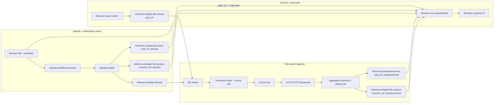

# Architecture

Канонический документ по связям между сервисами `voice-chat`, проектом `py_faster_whisper` и внешним `rag-stack`.

## Источники истины

- Compose и dev topology: [docker/docker-compose.yml](/home/komaroff/dev/monitorsoft/voice-chat/webrtc-komaroff/docker/docker-compose.yml)
- Deploy topology: [stack/webrtc.drs](/home/komaroff/dev/monitorsoft/voice-chat/webrtc-komaroff/stack/webrtc.drs)
- Browser/core/frontend code:
  - [src_front/src/config/appConfig.ts](/home/komaroff/dev/monitorsoft/voice-chat/webrtc-komaroff/src_front/src/config/appConfig.ts)
  - [src_front/src/assistant/assistantApp.ts](/home/komaroff/dev/monitorsoft/voice-chat/webrtc-komaroff/src_front/src/assistant/assistantApp.ts)
  - [src_core/main.py](/home/komaroff/dev/monitorsoft/voice-chat/webrtc-komaroff/src_core/main.py)
  - [src_core/handlers](/home/komaroff/dev/monitorsoft/voice-chat/webrtc-komaroff/src_core/handlers)
- Workflow/runtime/LLM/tool contracts:
  - [src_shared/contracts](/home/komaroff/dev/monitorsoft/voice-chat/webrtc-komaroff/src_shared/contracts)
  - [src_agent](/home/komaroff/dev/monitorsoft/voice-chat/webrtc-komaroff/src_agent)
  - [src_langgraph](/home/komaroff/dev/monitorsoft/voice-chat/webrtc-komaroff/src_langgraph)
  - [src_langgraph_rb](/home/komaroff/dev/monitorsoft/voice-chat/webrtc-komaroff/src_langgraph_rb)
  - [src_llm](/home/komaroff/dev/monitorsoft/voice-chat/webrtc-komaroff/src_llm)
  - [src_api_gateway/main.py](/home/komaroff/dev/monitorsoft/voice-chat/webrtc-komaroff/src_api_gateway/main.py)
- ASR live/file code:
  - [py_faster_whisper/src/stt_whisper_to_nats.py](/home/komaroff/dev/monitorsoft/voice-chat/py_faster_whisper/src/stt_whisper_to_nats.py)
  - [py_faster_whisper/src/webui/server.py](/home/komaroff/dev/monitorsoft/voice-chat/py_faster_whisper/src/webui/server.py)
  - [py_faster_whisper/src/webui/file_mode.py](/home/komaroff/dev/monitorsoft/voice-chat/py_faster_whisper/src/webui/file_mode.py)
- Внешний inference stack:
  - [rag-stack/stack/rag-stack.drs](/home/komaroff/dev/rag-stack/stack/rag-stack.drs)
  - [rag-stack/stack/llm-models.drs](/home/komaroff/dev/rag-stack/stack/llm-models.drs)

Важно: `src_shared/contracts/subjects.py` покрывает только часть Python subjects. Ruby subjects, file-ASR subjects и `rag-stack` bridge subjects берутся не из него, а из stack/env конфигурации.

## Legend

| Обозначение | Что значит |
| --- | --- |
| HTTP JSON | обычный JSON request/response |
| HTTP multipart | upload файла через `multipart/form-data` |
| WebRTC SDP | signaling `offer` / `answer` |
| WebRTC media | аудио-трек браузера в `src_core` |
| NATS req-reply | запрос-ответ через `nc.request(...)` |
| NATS pub-sub | асинхронная публикация событий |
| NATS WS | браузерский WebSocket-клиент к NATS |
| JetStream | persist/consumer layer внутри inference NATS |
| leafnode | NATS bridge между `rag-stack` и H100 inference cluster |
| Binary ASR packet | `[meta_len:u32 BE][meta_json UTF-8][pcm int16 LE]` |

## Правила чтения графиков

- Все графики ниже нарисованы как `flowchart LR`.
- Слева всегда источник данных, справа всегда конечный потребитель или итоговый результат.
- HTTP endpoints, NATS subjects, bridge subjects и `/ws` показаны как отдельные узлы, а не только как подписи на стрелках.
- Если есть request и result path, они разнесены в отдельные pipeline stages, чтобы не было “обратных” стрелок.
- Если один сервис общается через несколько транспортов, каждый transport path вынесен отдельно.

## Общая карта сервисов и проектов

```mermaid
flowchart LR
  subgraph Sources["Data sources"]
    G0["Browser text input"]
    G1["Browser mic / WebRTC media"]
    G2["Browser file upload"]
    G3["Browser cancel action"]
  end

  subgraph UiIngress["UI / ingress"]
    G4["src_front"]
    G5["/core/message | /core/history | /core/init_map"]
    G6["/core/offer"]
    G7["/whisper/api/file-transcribe"]
    G8["src_core ingress"]
  end

  subgraph LocalBus["Local buses / subjects"]
    G9["nats.agent.&lt;user_id&gt;"]
    G10["nats.agent.history.&lt;user_id&gt;"]
    G12["nats.workflow.run.python"]
    G13["nats.workflow.run.ruby"]
    G14["nats.llm.&lt;user_id&gt;"]
    G15["nats.tools.&lt;tool_name&gt;"]
    G16["inference.whisper.stream.&lt;session_id&gt;"]
    G17["inference.whisper.text.&lt;session_id&gt;"]
    G18["inference.whisper.file.job"]
    G19["inference.whisper.file.event.&lt;job_id&gt;"]
    G20["inference.whisper.file.session.&lt;session_id&gt;"]
    G21["inference.whisper.file.cancel.&lt;job_id&gt;"]
  end

  subgraph Workflow["Workflow backend"]
    G23["src_agent"]
    G24["src_langgraph"]
    G25["src_langgraph_rb"]
    G26["src_llm request side"]
    G27["src_api_gateway"]
    G28["src_postgres"]
    G29["runtime result data"]
  end

  subgraph Asr["ASR bridge"]
    G30["stt_whisper_to_nats / py_faster_whisper live path"]
    G31["file worker"]
    G32["src_core ASR receive + event publish"]
    G33["linto_stt_whisper_http"]
  end

  subgraph Inference["External inference"]
    G34["rag-stack nats2ollama request side"]
    G35["to.inference.ollama.requests"]
    G36["rag-stack inference_nats"]
    G37["leafnode bridge"]
    G38["inference.ollama.requests.&lt;listen_service_id&gt;.>"]
    G39["llm-models nats2ollama"]
    G40["ollama"]
    G41["inference.ollama.responses"]
    G42["from.inference.ollama.responses.&lt;service_id&gt;.>"]
    G43["rag-stack nats2ollama response side"]
  end

  subgraph Results["Result sinks"]
    G46["nats.events.&lt;user_id&gt;"]
    G47["/ws delivery"]
    G44["Browser subscriptions"]
    G45["Browser chat / map / progress UI"]
  end

  G0 --> G4 --> G5 --> G8
  G1 --> G4 --> G6 --> G8
  G2 --> G7 --> G18
  G2 --> G7 --> G19
  G2 --> G7 --> G20
  G3 --> G21 --> G31

  G8 -->|"AgentInboundRequest"| G9 --> G23
  G8 -->|"HistoryGetRequest"| G10 --> G23
  G8 -->|"Binary ASR packet"| G16 --> G30 -->|"phrase audio / chunk audio -> HTTP /transcribe"| G33 -->|"pending/final ASR JSON"| G17 --> G32
  G18 --> G31 -->|"normalize -> chunk loop -> HTTP /transcribe"| G33
  G31 -->|"progress/result JSON"| G19 --> G44
  G31 -->|"progress/result JSON"| G20 --> G44

  G23 -->|"runtime state read/write"| G28
  G23 -->|"WorkflowRunRequest"| G12 --> G24
  G23 -->|"WorkflowRunRequest"| G13 --> G25
  G24 -->|"LlmRequest"| G14 --> G26
  G25 -->|"LlmRequest"| G14
  G24 -->|"ToolCallRequest"| G15 --> G27
  G25 -->|"ToolCallRequest"| G15
  G26 -->|"HTTP /api/chat"| G34 -->|"publish request"| G35 --> G36 -->|"route into inference account"| G37 --> G38 --> G39 -->|"HTTP Ollama API"| G40 -->|"model response"| G39 --> G41 --> G37 -->|"import back into local account"| G42 --> G43 -->|"HTTP JSON response"| G29
  G27 -->|"ToolCallResponse data"| G29
  G24 -->|"WorkflowRunResponse data"| G29
  G25 -->|"WorkflowRunResponse data"| G29
  G8 -->|"HTTP JSON airports/list + pilot/location"| G27
  G32 -->|"ServerEvent from ASR path"| G46 --> G47 --> G44 --> G45
  G29 -->|"ServerEvent from workflow path"| G46
```



## Проекты и роли

| Проект / сервис | Роль | Inbound | Outbound | Реальный transport |
| --- | --- | --- | --- | --- |
| `src_front` | browser UI, mic UX, map UI | `/core/*`, `/ws` | `POST /core/offer`, `POST /core/message`, `GET /core/history`, `POST /core/init_map`, NATS WS | HTTP JSON, WebRTC, NATS WS |
| `src_core` | HTTP/WebRTC ingress, bridge между browser и backend NATS | `/core/*`, WebRTC media, `inference.whisper.text.*` | `nats.agent.*`, `nats.agent.history.*`, `nats.events.*`, `inference.whisper.stream.*`, `GET /api/airports/list`, `GET /api/pilot/location` | HTTP JSON, WebRTC, NATS req-reply, NATS pub-sub |
| `src_agent` | orchestration boundary, хранение runtime state | `nats.agent.*`, `nats.agent.history.*` | `nats.workflow.run.python|ruby`, PostgreSQL | NATS req-reply, SQL |
| `src_langgraph` | Python workflow runtime | `nats.workflow.run.python`, `nats.workflow.health.python` | `nats.llm.*`, `nats.tools.*` | NATS req-reply |
| `src_langgraph_rb` | Ruby workflow runtime | `nats.workflow.run.ruby`, `nats.workflow.health.ruby` | `nats.llm.*`, `nats.tools.*` | NATS req-reply |
| `src_llm` | unified LLM gateway | `nats.llm.<user_id>` | external `OLLAMA_URL` | NATS req-reply, HTTP JSON |
| `src_api_gateway` | tools service | HTTP `/api/*`, `nats.tools.*` | local data-only responses | HTTP JSON, NATS req-reply |
| `src_postgres` | session/runtime persistence | SQL from `src_agent` | none | PostgreSQL |
| `nats` / `audio_nats` | local UI + backend message bus | NATS core, WS ingress `/ws` | pub-sub and req-reply routing | NATS core, NATS WS |
| `py_faster_whisper` repo | кодовая база ASR bridge + WebUI `/whisper` | `inference.whisper.stream.*`, file-job subjects, `/whisper` | `inference.whisper.text.*`, file event subjects, LinTO HTTP | NATS pub-sub, HTTP multipart, HTTP |
| `stt_whisper_to_nats` deploy service | то же приложение из `py_faster_whisper`, но под deploy service name | live ASR, file jobs | LinTO HTTP, NATS events | NATS, HTTP |
| `rag-stack` `inference_nats` | inference transport/buffer layer | `to.inference.*`, `from.inference.*` | leafnode to H100 | NATS core, WS, JetStream, leafnode |
| `rag-stack` `nats2ollama` | HTTP bridge from app world to inference NATS | HTTP `/api/chat` | `to.inference.ollama.requests`, listens on `from.inference.ollama.responses.<service_id>.>` | HTTP JSON, JetStream |
| `llm-models` `nats2ollama` | H100-side bridge to real Ollama | `inference.ollama.requests.<listen_service_id>.>` | `inference.ollama.responses` | JetStream, HTTP JSON |
| `llm-models` `ollama` | actual LLM inference runtime | internal only | model responses | HTTP |
| `llm-models` `linto_stt_whisper_http` | STT HTTP backend | HTTP `/transcribe` | text / JSON transcript payloads | HTTP |
| `llm-models` `linto_stt_whisper` | STT websocket backend, развернут в inference stack, но текущий код `stt_whisper_to_nats` им не пользуется | websocket `/streaming` | streaming STT | WebSocket |

## Browser-facing интерфейсы

| Граница | Кто вызывает | Куда | Request type | Response type | Код |
| --- | --- | --- | --- | --- | --- |
| text turn | browser / `src_front` | `/core/message` | JSON `{ text, turn_id, session_id, edit? }` | JSON `{ status, session_id, error? }` | [commandHandler.ts](/home/komaroff/dev/monitorsoft/voice-chat/webrtc-komaroff/src_front/src/core/commandHandler.ts), [handle_message.py](/home/komaroff/dev/monitorsoft/voice-chat/webrtc-komaroff/src_core/handlers/handle_message.py) |
| WebRTC signaling | browser / `src_front` | `/core/offer` | JSON `{ sdp, type, session_id? }` | JSON `{ sdp, type, session_id }` | [negotiate.ts](/home/komaroff/dev/monitorsoft/voice-chat/webrtc-komaroff/src_front/src/webrtc/negotiate.ts), [handle_offer.py](/home/komaroff/dev/monitorsoft/voice-chat/webrtc-komaroff/src_core/handlers/handle_offer.py) |
| chat restore | browser / `src_front` | `/core/history` | query `session_id`, `limit` | JSON `{ ok, items, runtime_context, error? }` | [assistantApp.ts](/home/komaroff/dev/monitorsoft/voice-chat/webrtc-komaroff/src_front/src/assistant/assistantApp.ts), [handle_history.py](/home/komaroff/dev/monitorsoft/voice-chat/webrtc-komaroff/src_core/handlers/handle_history.py) |
| map bootstrap | browser / `src_front` | `/core/init_map` | empty POST | JSON status | [assistantApp.ts](/home/komaroff/dev/monitorsoft/voice-chat/webrtc-komaroff/src_front/src/assistant/assistantApp.ts), [handle_init_map.py](/home/komaroff/dev/monitorsoft/voice-chat/webrtc-komaroff/src_core/handlers/handle_init_map.py) |
| UI events stream | browser / `src_front` | `/ws` | NATS WS auth + subscribe to `nats.events.user123` | `ServerEvent` envelope | [appConfig.ts](/home/komaroff/dev/monitorsoft/voice-chat/webrtc-komaroff/src_front/src/config/appConfig.ts), [natsClient.ts](/home/komaroff/dev/monitorsoft/voice-chat/webrtc-komaroff/src_front/src/net/natsClient.ts) |
| file transcription | browser | `/whisper/api/file-transcribe` | `multipart/form-data` with `file`, `language?`, `session_id?`, `job_id?` | HTTP `202` JSON with `job_id`, `session_id`, `file_name`, `backend` | [server.py](/home/komaroff/dev/monitorsoft/voice-chat/py_faster_whisper/src/webui/server.py) |

Замечание: `src_front` сейчас подписывается на жестко заданный `nats.events.user123`, поэтому `USER_ID` в backend и NATS WS subject должны совпадать с этим значением или быть согласованно перенастроены.

## NATS subject registry

### Voice-chat subjects

| Subject | Pattern | Producer | Consumer | Payload |
| --- | --- | --- | --- | --- |
| Agent request | `nats.agent.<user_id>` | `src_core` | `src_agent` | `AgentInboundRequest` |
| Agent history | `nats.agent.history.<user_id>` | `src_core` | `src_agent` | `HistoryGetRequest` |
| UI events | `nats.events.<user_id>` | `src_core`, `src_agent` side effects | browser `src_front` | `ServerEvent` envelope |
| Python workflow run | `nats.workflow.run.python` | `src_agent` | `src_langgraph` | `WorkflowRunRequest` |
| Python workflow health | `nats.workflow.health.python` | health callers | `src_langgraph` | `ServiceHealthRequest` |
| Ruby workflow run | `nats.workflow.run.ruby` | `src_agent` | `src_langgraph_rb` | `WorkflowRunRequest` |
| Ruby workflow health | `nats.workflow.health.ruby` | health callers | `src_langgraph_rb` | `ServiceHealthRequest` |
| LLM call | `nats.llm.<user_id>` | `src_langgraph`, `src_langgraph_rb` | `src_llm` | `LlmRequest` |
| Tool call | `nats.tools.<tool_name>` | `src_langgraph`, `src_langgraph_rb` | `src_api_gateway` | `ToolCallRequest` |
| Tool discovery | `nats.tools.discover` | callers | `src_api_gateway` | discovery request/response |
| Live ASR input | `inference.whisper.stream.<session_id>` | `src_core` | `py_faster_whisper` / `stt_whisper_to_nats` | binary ASR packet |
| Live ASR output | `inference.whisper.text.<session_id>` | `py_faster_whisper` / `stt_whisper_to_nats` | `src_core` | JSON pending/final/error |
| File ASR job | `inference.whisper.file.job` | `/whisper` WebUI handler | file worker | JSON job payload |
| File ASR event | `inference.whisper.file.event.<job_id>` | file worker or upload handler | browser via NATS WS | JSON progress/result |
| File ASR session event | `inference.whisper.file.session.<session_id>` | file worker or upload handler | browser via NATS WS | JSON progress/result for session |
| File ASR cancel | `inference.whisper.file.cancel.<job_id>` | browser | file worker | JSON cancel request |

### `rag-stack` and H100 inference subjects

| Subject | Pattern | Producer | Consumer | Meaning |
| --- | --- | --- | --- | --- |
| outbound bridge request | `to.inference.ollama.requests` and reply-specific variants | `rag-stack` `nats2ollama` | `rag-stack` `inference_nats` | local app-side request namespace |
| inbound bridge response | `from.inference.ollama.responses.<service_id>.>` | `rag-stack` `inference_nats` | `rag-stack` `nats2ollama` | response namespace imported back to local account |
| inference request | `inference.ollama.requests.<listen_service_id>.>` | imported/bridged into inference account | H100 `llm-models` `nats2ollama` | actual remote Ollama request |
| inference response | `inference.ollama.responses` | H100 `llm-models` `nats2ollama` | bridge consumers | actual remote Ollama response |
| inference ASR input | `inference.whisper.stream.<sid>` | deploy ASR caller | inference stack consumers | streaming audio |
| inference ASR output | `inference.whisper.text.<sid>` | inference STT bridge | downstream callers | transcript JSON/text |

## Типы payload-ов

### Browser event envelope

`src_core` и backend публикуют browser-события в таком envelope:

```json
{
  "time": 1710000000.123,
  "service": "src_core",
  "type": "command",
  "kind": "transcription",
  "data": {
    "text": "Привет",
    "turn_id": "..."
  },
  "name": "transcription",
  "uid": "..."
}
```

Реально наблюдаемые `type/kind`:

- `log/info`
- `log/error`
- `command/message`
- `command/transcription`
- `command/transcription_pending`
- `command/thought`
- `command/status_vad`
- `command/status_asr`
- `command/status_llm`
- `command/voice`
- `command/client`

Код: [src_front/src/types.ts](/home/komaroff/dev/monitorsoft/voice-chat/webrtc-komaroff/src_front/src/types.ts), [src_core/utils/nats_logger.py](/home/komaroff/dev/monitorsoft/voice-chat/webrtc-komaroff/src_core/utils/nats_logger.py).

### Agent / workflow / LLM / tool contracts

| Contract | Основные поля | Источник |
| --- | --- | --- |
| `AgentInboundRequest` | `text`, `turn_id?`, `edit?`, `user_id?` + trace envelope | [src_shared/contracts/agent.py](/home/komaroff/dev/monitorsoft/voice-chat/webrtc-komaroff/src_shared/contracts/agent.py) |
| `AgentInboundResponse` | `ok`, `status`, `result`, `client_handler`, `client_events[]`, `errors[]` | [src_shared/contracts/agent.py](/home/komaroff/dev/monitorsoft/voice-chat/webrtc-komaroff/src_shared/contracts/agent.py) |
| `WorkflowRunRequest` | `text`, `turn_id?`, `edit?`, `runtime{active_workflow_id,pending,context,version}` | [src_shared/contracts/workflow.py](/home/komaroff/dev/monitorsoft/voice-chat/webrtc-komaroff/src_shared/contracts/workflow.py) |
| `WorkflowRunResponse` | `status`, `result`, `client_handler`, `client_events[]`, `next_runtime`, `errors[]` | [src_shared/contracts/workflow.py](/home/komaroff/dev/monitorsoft/voice-chat/webrtc-komaroff/src_shared/contracts/workflow.py) |
| `LlmRequest` | `mode`, `input`, `constraints` | [src_shared/contracts/llm.py](/home/komaroff/dev/monitorsoft/voice-chat/webrtc-komaroff/src_shared/contracts/llm.py) |
| `LlmResponse` | `ok`, `data?`, `error?` | [src_shared/contracts/llm.py](/home/komaroff/dev/monitorsoft/voice-chat/webrtc-komaroff/src_shared/contracts/llm.py) |
| `ToolCallRequest` | `tool_name`, `args` | [src_shared/contracts/tools.py](/home/komaroff/dev/monitorsoft/voice-chat/webrtc-komaroff/src_shared/contracts/tools.py) |
| `ToolCallResponse` | `ok`, `artifact_key?`, `data?`, `error?` | [src_shared/contracts/tools.py](/home/komaroff/dev/monitorsoft/voice-chat/webrtc-komaroff/src_shared/contracts/tools.py) |

Все эти envelope используют поля трассировки:

- `trace_id`
- `correlation_id`
- `request_id`
- `session_id`
- `ts_ms`

Источник: [src_shared/contracts/common.py](/home/komaroff/dev/monitorsoft/voice-chat/webrtc-komaroff/src_shared/contracts/common.py).

### Live ASR binary packet

`src_core` публикует live-audio в `inference.whisper.stream.<session_id>` в бинарном формате:

```text
[meta_len:u32 BE][meta_json UTF-8][pcm int16 LE]
```

Минимальный `meta_json`:

```json
{
  "type": "frame",
  "seq": 42,
  "sample_rate": 16000,
  "sample_width": 2,
  "channels": 1,
  "session_id": "..."
}
```

Код: [src_core/processors/whisper_stream_node.py](/home/komaroff/dev/monitorsoft/voice-chat/webrtc-komaroff/src_core/processors/whisper_stream_node.py), [py_faster_whisper/src/utils/wire_packet.py](/home/komaroff/dev/monitorsoft/voice-chat/py_faster_whisper/src/utils/wire_packet.py).

### Live ASR output JSON

Pending:

```json
{
  "pending": true,
  "phrase_id": "uuid",
  "session_id": "..."
}
```

Final:

```json
{
  "phrase_id": "uuid",
  "text": "распознанная фраза",
  "duration": 1.42,
  "session_id": "..."
}
```

Error:

```json
{
  "phrase_id": "uuid",
  "error": "transcription_failed",
  "details": "..."
}
```

Код: [py_faster_whisper/src/stt_whisper_to_nats.py](/home/komaroff/dev/monitorsoft/voice-chat/py_faster_whisper/src/stt_whisper_to_nats.py).

### File job payload

Upload handler публикует:

```json
{
  "job_id": "uuid",
  "session_id": "s1",
  "file_name": "input.mp3",
  "file_path": "/tmp/whisper-file-jobs/.../input.mp3",
  "language": "ru"
}
```

Прогресс/result события содержат `type`, `phase`, `job_id`, `session_id?`, `file_name`, а в конце итоговый текст и debug info.

Код: [py_faster_whisper/src/webui/server.py](/home/komaroff/dev/monitorsoft/voice-chat/py_faster_whisper/src/webui/server.py), [py_faster_whisper/src/stt_whisper_to_nats.py](/home/komaroff/dev/monitorsoft/voice-chat/py_faster_whisper/src/stt_whisper_to_nats.py), [py_faster_whisper/src/webui/file_mode.py](/home/komaroff/dev/monitorsoft/voice-chat/py_faster_whisper/src/webui/file_mode.py).

## Pipeline diagrams

### 1. Текстовый пользовательский запрос

```mermaid
flowchart LR
  subgraph Input["Input path"]
    T0["Browser text input"]
    T1["src_front"]
    T2["POST /core/message"]
    T3["src_core"]
    T4["nats.agent.&lt;user_id&gt;"]
    T5["src_agent"]
    T6["nats.workflow.run.python | nats.workflow.run.ruby"]
    T7["runtime entry: src_langgraph | src_langgraph_rb"]
  end

  subgraph RuntimeDeps["Runtime dependency paths"]
    L1["nats.llm.&lt;user_id&gt;"]
    L2["src_llm"]
    L3["LLM data"]
    A1["nats.tools.&lt;tool_name&gt;"]
    A2["src_api_gateway"]
    A3["Tool data"]
    R1["runtime response builder"]
  end

  subgraph Output["Result path"]
    O1["WorkflowRunResponse"]
    O2["AgentInboundResponse"]
    O3["nats.events.&lt;user_id&gt;"]
    O4["/ws"]
    O5["Browser chat / map update"]
  end

  T0 --> T1 --> T2 --> T3 -->|"AgentInboundRequest"| T4 --> T5 -->|"WorkflowRunRequest"| T6 --> T7
  T7 -->|"LlmRequest"| L1 --> L2 -->|"LlmResponse data"| L3 --> R1
  T7 -->|"ToolCallRequest"| A1 --> A2 -->|"ToolCallResponse data"| A3 --> R1
  T7 -->|"workflow local state + prompts"| R1 --> O1 --> O2 --> O3 --> O4 --> O5
```



### 2. Live `/chat` voice flow

```mermaid
flowchart LR
  subgraph Signaling["Signaling / session setup"]
    V0["Browser mic start"]
    V1["src_front"]
    V2["POST /core/offer"]
    V3["src_core WebRTC session"]
  end

  subgraph AsrPipe["ASR pipeline"]
    V4["WebRTC audio track"]
    V5["inference.whisper.stream.&lt;session_id&gt;"]
    V6["stt_whisper_to_nats"]
    V7["LinTO HTTP /transcribe"]
    V8["inference.whisper.text.&lt;session_id&gt; pending JSON"]
    V9["inference.whisper.text.&lt;session_id&gt; final JSON"]
    V10["src_core transcription handler"]
  end

  subgraph WorkflowPipe["Workflow + UI result"]
    V11["nats.events.&lt;user_id&gt; transcription + voice lock"]
    V12["nats.agent.&lt;user_id&gt;"]
    V13["src_agent -> runtime"]
    V14["nats.events.&lt;user_id&gt; message / thought / client"]
    V15["/ws"]
    V16["Browser chat / map / mic state"]
  end

  V0 --> V1 --> V2 --> V3
  V0 --> V4 --> V3 -->|"Binary ASR packet"| V5 --> V6 -->|"phrase audio"| V7
  V6 -->|"phrase accepted -> pending marker"| V8 --> V10
  V7 -->|"final recognized text"| V9 --> V10
  V10 --> V11 --> V15 --> V16
  V10 -->|"AgentInboundRequest from ASR text"| V12 --> V13 -->|"Server events from workflow"| V14 --> V15
```



Важно: текущий код `stt_whisper_to_nats` для live phrase transcription использует `LINTO_HTTP_URL`, а не `LINTO_WS_URL`. WebSocket backend LinTO развернут в inference stack, но в текущей версии приложения не используется.

### 3. `/whisper` file flow



### 4. `src_llm` и `rag-stack`

```mermaid
flowchart LR
  subgraph AppSide["Application side"]
    L0["runtime LLM request"]
    L1["nats.llm.&lt;user_id&gt;"]
    L2["src_llm request handler"]
    L3["HTTP /api/chat"]
    L4["rag-stack nats2ollama request side"]
  end

  subgraph RagStack["rag-stack transport"]
    L5["to.inference.ollama.requests"]
    L6["rag-stack inference_nats"]
    L7["leafnode bridge"]
    L8["from.inference.ollama.responses.&lt;service_id&gt;.>"]
  end

  subgraph H100Side["llm-models / H100 side"]
    L9["inference.ollama.requests.&lt;listen_service_id&gt;.>"]
    L10["llm-models nats2ollama"]
    L11["HTTP Ollama API"]
    L12["ollama"]
    L13["inference.ollama.responses"]
  end

  subgraph ResultSide["Result side"]
    L14["rag-stack nats2ollama response side"]
    L15["HTTP JSON response"]
    L16["src_llm normalized LlmResponse"]
    L17["runtime receives LlmResponse"]
  end

  L0 -->|"LlmRequest"| L1 --> L2 --> L3 --> L4
  L4 -->|"publish request"| L5 --> L6 -->|"route into inference account"| L7 --> L9 --> L10 --> L11 --> L12
  L12 -->|"model response"| L11 --> L10 --> L13 --> L7 -->|"import back into local account"| L8 --> L14 --> L15 --> L16 --> L17
```



## Кто куда реально вызывает

### `src_core`

- browser-facing:
  - `GET /core`
  - `POST /core/offer`
  - `POST /core/message`
  - `GET /core/history`
  - `POST /core/init_map`
- NATS outbound:
  - `nats.agent.<user_id>`
  - `nats.agent.history.<user_id>`
  - `nats.events.<user_id>`
  - `inference.whisper.stream.<session_id>`
- NATS inbound:
  - `inference.whisper.text.<session_id>`
- direct HTTP dependency:
  - `GET {API_URL}/airports/list`
  - `GET {API_URL}/pilot/location`

Код: [src_core/main.py](/home/komaroff/dev/monitorsoft/voice-chat/webrtc-komaroff/src_core/main.py), [src_core/handlers](/home/komaroff/dev/monitorsoft/voice-chat/webrtc-komaroff/src_core/handlers), [src_core/processors/whisper_stream_node.py](/home/komaroff/dev/monitorsoft/voice-chat/webrtc-komaroff/src_core/processors/whisper_stream_node.py).

### `src_agent`

- inbound subjects:
  - `nats.agent.<user_id>`
  - `nats.agent.history.<user_id>`
- outbound:
  - `nats.workflow.run.python` или `nats.workflow.run.ruby`
- storage:
  - PostgreSQL runtime/session history

Код: [src_agent/main.py](/home/komaroff/dev/monitorsoft/voice-chat/webrtc-komaroff/src_agent/main.py), [src_agent/service.py](/home/komaroff/dev/monitorsoft/voice-chat/webrtc-komaroff/src_agent/service.py), [src_agent/agent.py](/home/komaroff/dev/monitorsoft/voice-chat/webrtc-komaroff/src_agent/agent.py).

### `src_langgraph` и `src_langgraph_rb`

- inbound:
  - `nats.workflow.run.python` / `nats.workflow.run.ruby`
  - `nats.workflow.health.python` / `nats.workflow.health.ruby`
- outbound:
  - `nats.llm.<user_id>`
  - `nats.tools.<tool_name>`

Python code: [src_langgraph](/home/komaroff/dev/monitorsoft/voice-chat/webrtc-komaroff/src_langgraph)  
Ruby code: [src_langgraph_rb](/home/komaroff/dev/monitorsoft/voice-chat/webrtc-komaroff/src_langgraph_rb)

### `src_llm`

- inbound:
  - `nats.llm.<user_id>`
- outbound:
  - HTTP `POST {OLLAMA_URL}/api/chat`
- typical deploy target:
  - `https://nats2ollama.gis-master.ru`

Код: [src_llm/main.py](/home/komaroff/dev/monitorsoft/voice-chat/webrtc-komaroff/src_llm/main.py), [src_llm/service.py](/home/komaroff/dev/monitorsoft/voice-chat/webrtc-komaroff/src_llm/service.py), [src_llm/clients/ollama_chat.py](/home/komaroff/dev/monitorsoft/voice-chat/webrtc-komaroff/src_llm/clients/ollama_chat.py).

### `src_api_gateway`

- inbound HTTP:
  - `/api/airports/list`
  - `/api/pilot/location`
  - другие tool endpoints, используемые и по HTTP, и по NATS
- inbound NATS wildcard:
  - `nats.tools.*`
- actual tools exposed:
  - `search_airports_nearby`
  - `get_weather`
  - `get_flight_status`
  - `get_current_position`
  - `build_route`
  - `discover`

Код: [src_api_gateway/main.py](/home/komaroff/dev/monitorsoft/voice-chat/webrtc-komaroff/src_api_gateway/main.py).

## Ошибки на границах

| Граница | Типовые коды / симптомы | Где нормализуется |
| --- | --- | --- |
| `src_core -> src_agent` | HTTP `502/504`, downstream error details | [src_core/handlers/handle_message.py](/home/komaroff/dev/monitorsoft/voice-chat/webrtc-komaroff/src_core/handlers/handle_message.py) |
| `src_agent -> runtime` | `workflow_timeout`, `workflow_unavailable`, `runtime_state_conflict`, `edit_turn_not_found` | [src_agent/agent.py](/home/komaroff/dev/monitorsoft/voice-chat/webrtc-komaroff/src_agent/agent.py) |
| Python runtime | `invalid_request`, `missing_session_id`, `workflow_failed`, `health_failed`, `nats_timeout`, `llm_transport_error`, `tool_transport_error` | [src_langgraph/service.py](/home/komaroff/dev/monitorsoft/voice-chat/webrtc-komaroff/src_langgraph/service.py), [src_langgraph/runtime_io.py](/home/komaroff/dev/monitorsoft/voice-chat/webrtc-komaroff/src_langgraph/runtime_io.py) |
| Ruby runtime | `workflow_failed`, `health_failed`, `llm_transport_error`, `tool_transport_error`, invalid downstream JSON | [src_langgraph_rb/lib/src_langgraph_rb/runtime/service.rb](/home/komaroff/dev/monitorsoft/voice-chat/webrtc-komaroff/src_langgraph_rb/lib/src_langgraph_rb/runtime/service.rb), [src_langgraph_rb/lib/src_langgraph_rb/runtime/runtime_io.rb](/home/komaroff/dev/monitorsoft/voice-chat/webrtc-komaroff/src_langgraph_rb/lib/src_langgraph_rb/runtime/runtime_io.rb) |
| `src_llm` | `invalid_request`, `llm_failed`, upstream JSON errors from Ollama bridge | [src_llm/service.py](/home/komaroff/dev/monitorsoft/voice-chat/webrtc-komaroff/src_llm/service.py) |
| `src_api_gateway` | `unknown_tool`, `invalid_args`, `not_found`, `unknown_city`, `tool_exception` | [src_api_gateway/main.py](/home/komaroff/dev/monitorsoft/voice-chat/webrtc-komaroff/src_api_gateway/main.py) |
| live ASR | `invalid_packet`, `unsupported_packet_type`, `transcription_failed` | [py_faster_whisper/src/stt_whisper_to_nats.py](/home/komaroff/dev/monitorsoft/voice-chat/py_faster_whisper/src/stt_whisper_to_nats.py) |
| file ASR | `job_error`, missing file, cancel before processing, missing `LINTO_HTTP_URL`, missing word timestamps | [py_faster_whisper/src/stt_whisper_to_nats.py](/home/komaroff/dev/monitorsoft/voice-chat/py_faster_whisper/src/stt_whisper_to_nats.py), [py_faster_whisper/src/webui/file_mode.py](/home/komaroff/dev/monitorsoft/voice-chat/py_faster_whisper/src/webui/file_mode.py) |

## Что рисовать на итоговой картинке

Если потом переносить это в отдельную схему/диаграмму, сохранять именно эти уровни:

1. Browser edge:
   `/core/offer`, `/core/message`, `/core/history`, `/core/init_map`, `/ws`, `/whisper`
2. Core bus layer:
   `nats.agent.*`, `nats.agent.history.*`, `nats.events.*`, `inference.whisper.stream.*`, `inference.whisper.text.*`
3. Runtime layer:
   `src_agent`, `src_langgraph`, `src_langgraph_rb`, `src_llm`, `src_api_gateway`, `src_postgres`
4. ASR side:
   `py_faster_whisper` / `stt_whisper_to_nats`, file worker, LinTO HTTP
5. External inference:
   `rag-stack nats2ollama`, `rag-stack inference_nats`, leafnode, `llm-models nats2ollama`, `ollama`
6. Подписи на ребрах:
   protocol, subject/endpoint, request type, response type
