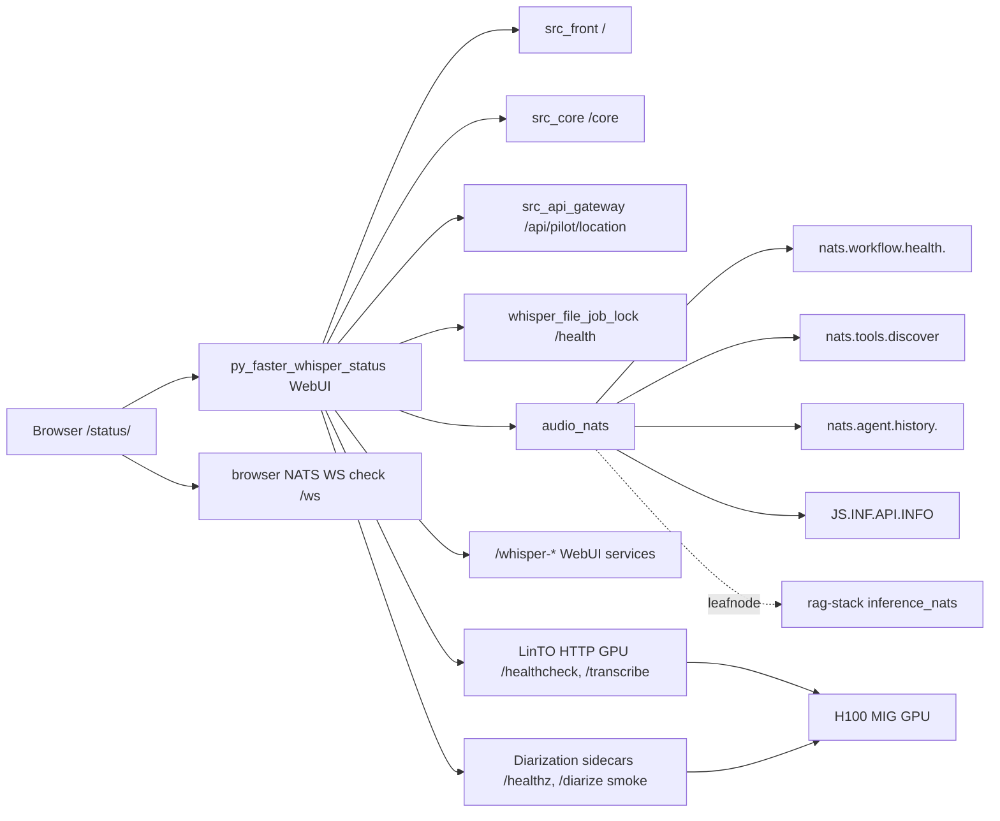
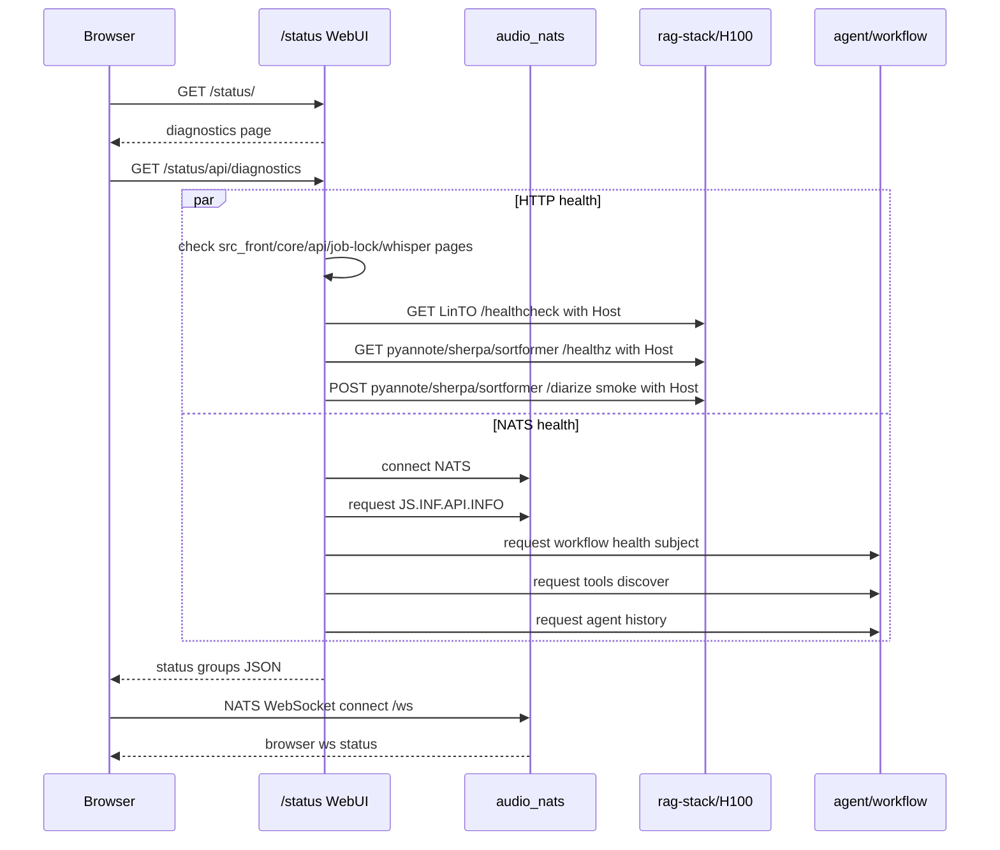
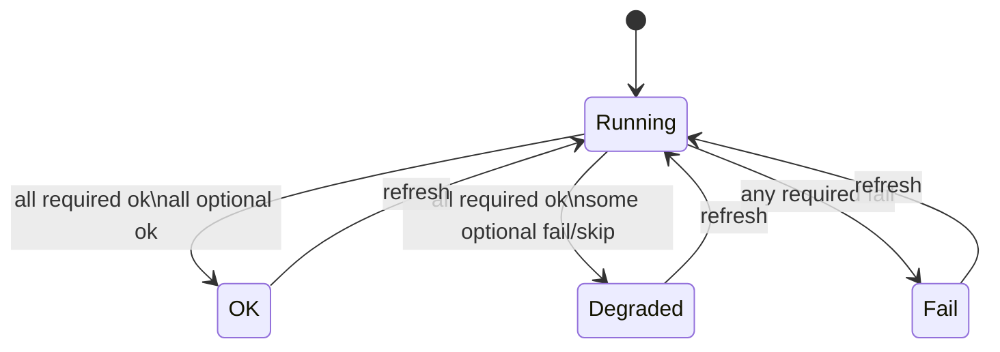
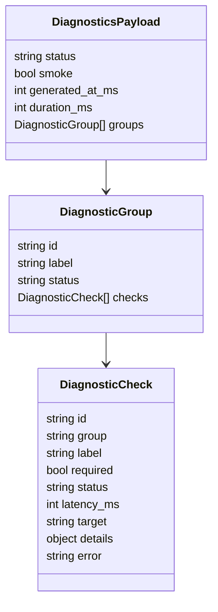
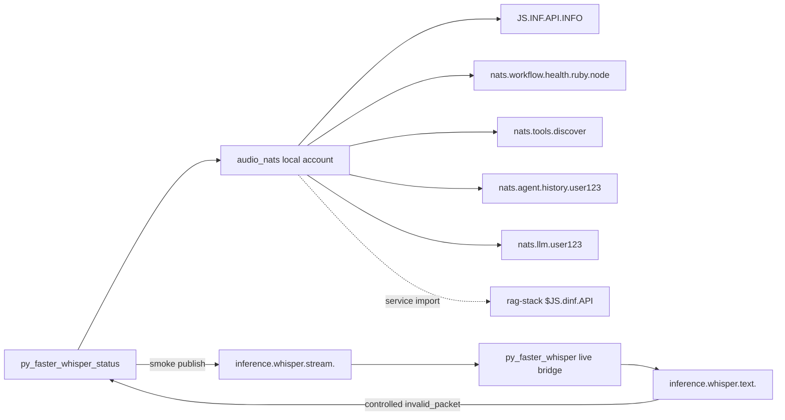

# Voice Chat Diagnostics

Страница быстрой диагностики живет на `/status/` основного host-а `webrtc-komaroff`. `/health/` оставлен как compatibility alias.

Она проверяет не только сам WebUI-контейнер, а рабочие границы voice-chat:

- browser -> `/ws` NATS WebSocket
- `src_front`, `src_core`, `src_api_gateway`
- `audio_nats`, leafnode/import к H100 inference NATS
- `src_agent`, active workflow runtime, tools, LLM
- `py_faster_whisper` страницы и live bridge
- LinTO HTTP на GPU
- diarization sidecar-ы `pyannote`, `sherpa-onnx`, `sortformer`

Обычный `Refresh` делает быстрые health/request-reply проверки. `Run smoke` дополнительно запускает безопасные smoke-тесты: короткий LinTO `/transcribe`, diarization `/diarize` smoke для sidecar-ов, live ASR bridge controlled-error test и LLM routing request.

LinTO HTTP smoke отправляет `Accept: application/json`. Это важно: текущий LinTO `/transcribe` отвергает default `Accept: */*` и возвращает `400 Not accepted header`, хотя GPU backend при этом может быть жив.

## Проверка После Деплоя

1. В Insight stack `web-rtc-komaroff` должен появиться сервис `web-rtc-komaroff_py_faster_whisper_status`.
2. `GET https://webrtc-komaroff.gis-master.ru/status/` должен открыть страницу `Voice Chat Status`.
3. `GET https://webrtc-komaroff.gis-master.ru/status/api/diagnostics` должен вернуть `Content-Type: application/json` и payload со статусами групп.
4. `GET https://webrtc-komaroff.gis-master.ru/health/` должен открыть тот же diagnostics WebUI через compatibility rewrite.

Если `/status/` открывает старый `Voice Assistant`, а `/status/api/diagnostics` возвращает HTML, значит новый route не попал в Docker stack/Traefik, даже если image `py_faster_whisper` уже обновился.

## GitLab Deploy Access

`/status/` появляется только после успешного deploy job в GitLab для `webrtc-komaroff`, потому что именно этот job добавляет route и service `py_faster_whisper_status` в stack `web-rtc-komaroff`.

Deploy не должен чиниться ручными командами на `gis-master`. Доступ для `dry-stack` должен прийти в GitLab runner одним из двух способов:

1. восстановить identities в runner volume `ssh-agent-socket`;
2. добавить GitLab CI/CD variable `GIS_MASTER_SSH_PRIVATE_KEY_B64`.

Рекомендуемый вариант для проекта или группы `voice-chat`:

```bash
base64 -w0 ~/.ssh/<deploy-key>
```

Результат кладется в protected CI/CD variable `GIS_MASTER_SSH_PRIVATE_KEY_B64`. Ключ должен быть уже разрешен для `root@gis-master.ru`, потому что Docker SSH context внутри deploy container идет как root. После этого надо rerun pipeline `webrtc-komaroff` на `main`. В trace должно появиться:

```text
[deploy] loading SSH key from GitLab CI base64 variable GIS_MASTER_SSH_PRIVATE_KEY_B64
[deploy] dry-stack endpoint ssh://gis-master.ru
```

Если вместо этого видно `The agent has no identities` или `no SSH identity is available for dry-stack`, GitLab runner всё еще не получил deploy identity.

## Статусы

- `OK` - все обязательные и optional проверки зеленые.
- `DEGRADED` - основной production path жив, но сломан optional sidecar или необязательная страница.
- `FAIL` - сломана обязательная граница: HTTP core, NATS, LinTO HTTP, shared pyannote, active workflow, tools, history/Postgres или browser `/ws`.

Optional сервисы не валят всю страницу в `FAIL`: `pyannote_isolated`, `sherpa_onnx`, `sortformer`, `/whisper-staged`, `/whisper-bench`.

## Общая Схема



## Sequence Diagram



## UML State Diagram



## Data Shape



## NATS Связи



## Что Смотреть При Поломке

- LinTO `502`: если `/healthcheck` красный, но контейнер `running`, смотреть startup/model-load path и порт `80` внутри LinTO.
- NATS `NoResponders`: смотреть subject из `target`, активный `WORKFLOW_RUNTIME` и подписку соответствующего runtime.
- `agent history / Postgres` красный: NATS дошел до `src_agent`, но DB/history boundary не отвечает.
- Browser `/ws` красный при зеленом backend NATS: проблема на ingress/websocket path, auth или browser-facing NATS config.
- Optional diarization красный и общий `DEGRADED`: основной путь может работать, но сравнение/альтернативный backend недоступен.
