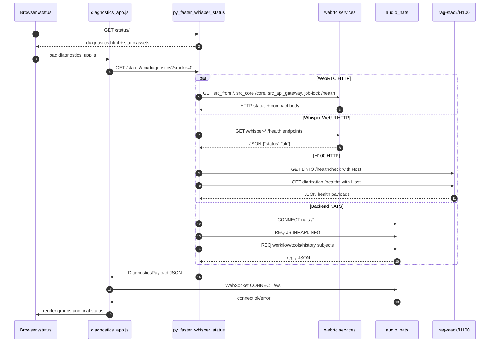
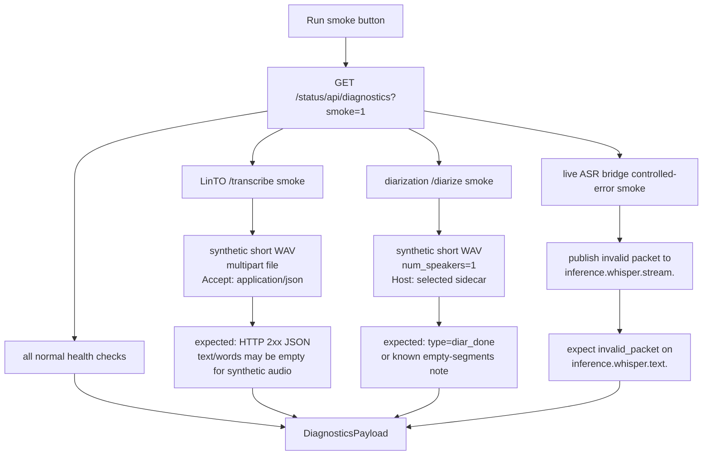
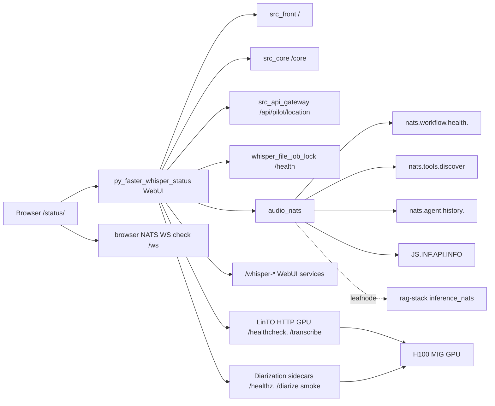
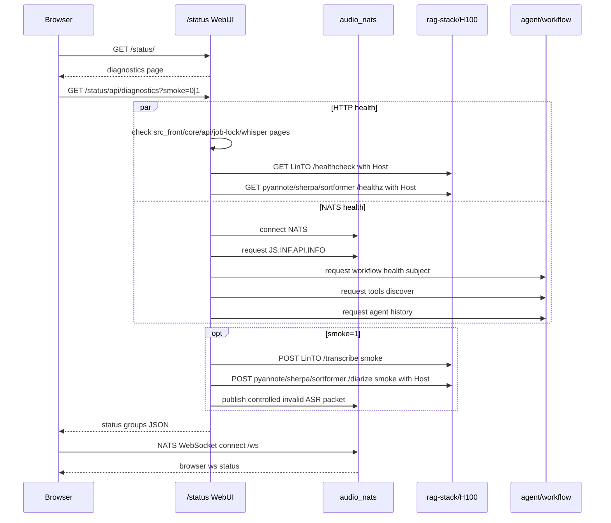
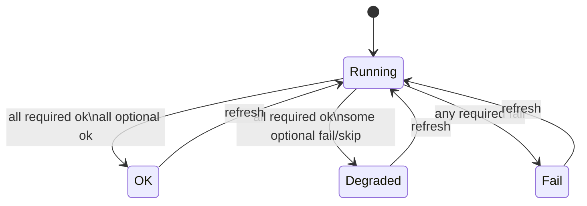
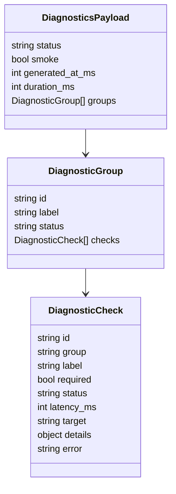
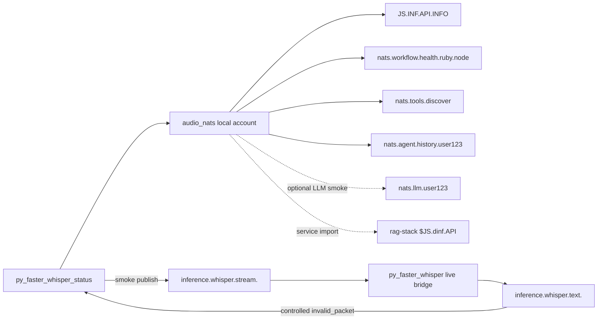

# Voice Chat Diagnostics

Страница быстрой диагностики живет на `/status/` основного host-а `webrtc-komaroff`. `/health/` оставлен как compatibility alias.

Она проверяет не только сам WebUI-контейнер, а рабочие границы voice-chat:

- browser -> `/ws` NATS WebSocket
- `src_front`, `src_core`, `src_api_gateway`
- `audio_nats`, leafnode/import к H100 inference NATS
- `src_agent`, active workflow runtime, tools, history/Postgres; LLM routing smoke включается отдельно через `DIAGNOSTICS_LLM_SMOKE_ENABLED=1`
- `py_faster_whisper` страницы и live bridge
- LinTO HTTP на GPU
- diarization sidecar-ы `pyannote`, `sherpa-onnx`, `sortformer`

Обычный `Refresh` делает быстрые health/request-reply проверки. `Run smoke` дополнительно запускает безопасные smoke-тесты для transcription/diarization path: короткий LinTO `/transcribe`, diarization `/diarize` smoke для sidecar-ов и live ASR bridge controlled-error test. LLM routing smoke можно включить отдельно через `DIAGNOSTICS_LLM_SMOKE_ENABLED=1`.

LinTO HTTP smoke отправляет `Accept: application/json`. Это важно: текущий LinTO `/transcribe` отвергает default `Accept: */*` и возвращает `400 Not accepted header`, хотя GPU backend при этом может быть жив.

## Где Описана Страница

`/status/` не живет в frontend nginx. Это отдельный WebUI mode внутри image `voice-chat/stt_whisper_to_nats` из репозитория `py_faster_whisper`.

Основные файлы:

| Что | Где |
| --- | --- |
| production service, route `/status`, alias `/health` и env для проверок | [`webrtc-komaroff/stack/webrtc.drs`](../stack/webrtc.drs) |
| aiohttp route `/status/`, `/status/health`, `/status/api/diagnostics`, static assets | [`py_faster_whisper/src/webui/server.py`](../../py_faster_whisper/src/webui/server.py) |
| backend runner, HTTP checks, NATS checks, smoke tests, redaction | [`py_faster_whisper/src/webui/diagnostics.py`](../../py_faster_whisper/src/webui/diagnostics.py) |
| HTML shell страницы | [`py_faster_whisper/src/webui/static/diagnostics.html`](../../py_faster_whisper/src/webui/static/diagnostics.html) |
| browser-side fetch/render и browser `/ws` NATS check | [`py_faster_whisper/src/webui/static/diagnostics_app.js`](../../py_faster_whisper/src/webui/static/diagnostics_app.js) |
| favicon страницы | [`py_faster_whisper/src/webui/static/status-favicon.svg`](../../py_faster_whisper/src/webui/static/status-favicon.svg) |

Важно: backend JSON редактирует чувствительные значения в `details`, но сама страница всё равно получает NATS WebSocket credentials через meta tags, чтобы browser мог проверить `/ws`. Поэтому `/status/` считается internal diagnostic page, а не публичной debug-страницей для внешних пользователей.

## Как Собирается Информация

Информация собирается в два слоя.

Первый слой выполняет контейнер `web-rtc-komaroff_py_faster_whisper_status`:

1. `DiagnosticsRunner.run()` делает HTTP health checks для `webrtc`, `py_faster_whisper` и `rag-stack / H100`.
2. Если `smoke=1`, runner дополнительно отправляет короткий synthetic WAV в LinTO `/transcribe` и diarization sidecar `/diarize`.
3. Runner подключается к `audio_nats` и делает request/reply проверки `JS.INF.API.INFO`, workflow health, tools discover и agent history.
4. Результаты группируются в `webrtc`, `whisper`, `rag_stack`, `nats`, `agent`.

Второй слой выполняет браузер:

1. `diagnostics_app.js` делает `fetch('/status/api/diagnostics?smoke=0|1')`.
2. После ответа backend-а браузер отдельно проверяет NATS WebSocket `/ws`.
3. Результат browser check добавляется как отдельная группа `browser`.
4. Итоговый статус страницы становится `fail`, если browser `/ws` не подключился, даже когда backend NATS зеленый.

## Источники Данных

| Группа | Check id | Required | Источник | Что проверяет |
| --- | --- | --- | --- | --- |
| `webrtc` | `front_http` | yes | `src_front /` | frontend container отвечает HTTP 200 |
| `webrtc` | `core_http` | yes | `src_core /core` | core route жив и не уводит запрос в не тот сервис |
| `webrtc` | `api_gateway_http` | yes | `src_api_gateway /api/pilot/location` | gateway отвечает JSON |
| `webrtc` | `file_job_lock_http` | yes | `whisper_file_job_lock /health` | общий lock для file jobs доступен |
| `whisper` | `whisper_transcribe_webui` | yes | `/whisper-trasncription/health` | transcribe WebUI service жив |
| `whisper` | `whisper_diarize_webui` | yes | `/whisper-diarization/health` | diarization WebUI service жив |
| `whisper` | `whisper_summary_webui` | yes | `/whisper-summary/health` | summary WebUI service жив |
| `whisper` | `whisper_staged_webui` | no | `/whisper-staged/health` | staged profiler жив |
| `whisper` | `whisper_bench_webui` | no | `/whisper-bench/health` | benchmark UI жив |
| `whisper` | `live_asr_bridge_smoke` | yes | NATS `inference.whisper.stream.<diagnostics>` | live ASR bridge отвечает controlled `invalid_packet` |
| `rag_stack` | `linto_http_health` | yes | H100 LinTO `/healthcheck` | transcription GPU backend доступен |
| `rag_stack` | `linto_transcribe_smoke` | yes | H100 LinTO `/transcribe` | short WAV реально проходит ASR HTTP boundary |
| `rag_stack` | `pyannote_shared_health` | yes | H100 pyannote shared `/healthz` | основной diarization backend доступен |
| `rag_stack` | `pyannote_shared_diarize_smoke` | yes | H100 pyannote shared `/diarize` | short WAV проходит основной diarization HTTP boundary |
| `rag_stack` | `pyannote_isolated_*` | no | H100 pyannote isolated | optional isolated benchmark backend |
| `rag_stack` | `sherpa_onnx_*` | no | H100 sherpa-onnx | optional ONNX diarization backend |
| `rag_stack` | `sortformer_*` | no | H100 sortformer | optional NeMo/NVIDIA diarization backend |
| `nats` | `audio_nats connect` | yes | `audio_nats` | TCP/auth connect к локальному NATS |
| `nats` | `nats_js_info` | yes | `JS.INF.API.INFO` | service import к inference JetStream API |
| `agent` | `workflow_health_active` | yes | `nats.workflow.health.<active>` | активный workflow runtime отвечает |
| `agent` | `tools_discover` | yes | `nats.tools.discover` | tools boundary доступен |
| `agent` | `agent_history_db` | yes | `nats.agent.history.<user>` | agent/Postgres history boundary доступен |
| `browser` | `browser_nats_ws` | yes | `/ws` | browser-facing NATS WebSocket route работает |

## Detailed Collection UML



## Smoke Test UML



## Проверка После Деплоя

1. В Insight stack `web-rtc-komaroff` должен появиться сервис `web-rtc-komaroff_py_faster_whisper_status`.
2. `GET https://webrtc-komaroff.gis-master.ru/status/` должен открыть страницу `Voice Chat Status`.
3. `GET https://webrtc-komaroff.gis-master.ru/status/api/diagnostics` должен вернуть `Content-Type: application/json` и payload со статусами групп.
4. `GET https://webrtc-komaroff.gis-master.ru/health/` должен открыть тот же diagnostics WebUI через compatibility rewrite.

Если `/status/` открывает старый `Voice Assistant`, а `/status/api/diagnostics` возвращает HTML, значит новый route не попал в Docker stack/Traefik, даже если image `py_faster_whisper` уже обновился.

## GitLab Deploy Access

`/status/` появляется только после успешного deploy job в GitLab для `webrtc-komaroff`, потому что именно этот job добавляет route и service `py_faster_whisper_status` в stack `web-rtc-komaroff`.

Deploy не должен чиниться ручными командами на `gis-master`. Доступ для `dry-stack` должен прийти в GitLab runner одним из двух способов:

1. восстановить identities в runner volume `ssh-agent-socket`;
2. добавить GitLab CI/CD variable `GIS_MASTER_SSH_PRIVATE_KEY_B64`.

Рекомендуемый вариант для проекта или группы `voice-chat`:

```bash
base64 -w0 ~/.ssh/<deploy-key>
```

Результат кладется в protected CI/CD variable `GIS_MASTER_SSH_PRIVATE_KEY_B64`. Ключ должен быть уже разрешен для `root@gis-master.ru`, потому что Docker SSH context внутри deploy container идет как root. После этого надо rerun pipeline `webrtc-komaroff` на `main`. В trace должно появиться:

```text
[deploy] loading SSH key from GitLab CI base64 variable GIS_MASTER_SSH_PRIVATE_KEY_B64
[deploy] dry-stack endpoint ssh://gis-master.ru
```

Если вместо этого видно `The agent has no identities` или `no SSH identity is available for dry-stack`, GitLab runner всё еще не получил deploy identity.

## Статусы

- `OK` - все обязательные и optional проверки зеленые.
- `DEGRADED` - основной production path жив, но сломан optional sidecar или необязательная страница.
- `FAIL` - сломана обязательная граница: HTTP core, NATS, LinTO HTTP, shared pyannote, active workflow, tools, history/Postgres или browser `/ws`.

Optional сервисы не валят всю страницу в `FAIL`: `pyannote_isolated`, `sherpa_onnx`, `sortformer`, `/whisper-staged`, `/whisper-bench`.

## Общая Схема



## Sequence Diagram



## UML State Diagram



## Data Shape



## NATS Связи



## Что Смотреть При Поломке

- LinTO `502`: если `/healthcheck` красный, но контейнер `running`, смотреть startup/model-load path и порт `80` внутри LinTO.
- NATS `NoResponders`: смотреть subject из `target`, активный `WORKFLOW_RUNTIME` и подписку соответствующего runtime.
- `agent history / Postgres` красный: NATS дошел до `src_agent`, но DB/history boundary не отвечает.
- Browser `/ws` красный при зеленом backend NATS: проблема на ingress/websocket path, auth или browser-facing NATS config.
- Optional diarization красный и общий `DEGRADED`: основной путь может работать, но сравнение/альтернативный backend недоступен.
