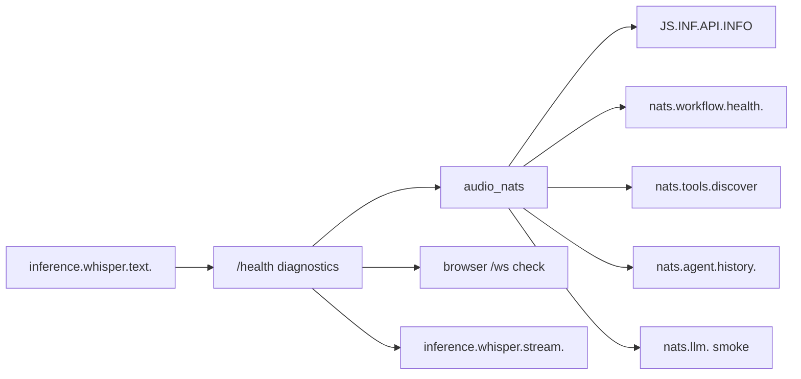

# NATS

`src_shared/contracts/subjects.py` покрывает только часть Python subject prefixes. Полная картина берется из нескольких источников:

- [src_shared/contracts](/home/komaroff/dev/monitorsoft/voice-chat/webrtc-komaroff/src_shared/contracts)
- [stack/webrtc.drs](/home/komaroff/dev/monitorsoft/voice-chat/webrtc-komaroff/stack/webrtc.drs)
- [py_faster_whisper/src/env.example](/home/komaroff/dev/monitorsoft/voice-chat/py_faster_whisper/src/env.example)
- [rag-stack/stack/rag-stack.drs](/home/komaroff/dev/rag-stack/stack/rag-stack.drs)
- [rag-stack/stack/llm-models.drs](/home/komaroff/dev/rag-stack/stack/llm-models.drs)

Каноническая подробная схема по всем subject-ам, payload-ам и transport layers: [`ARCHITECTURE.md`](/home/komaroff/dev/monitorsoft/voice-chat/webrtc-komaroff/DOCS/ARCHITECTURE.md)

## Основные subjects

- `nats.agent.<user_id>` — вход в `src_agent` (req-reply).
- `nats.agent.history.<user_id>` — запрос истории чата из `src_agent` (req-reply).
- `nats.events.<user_id>` — события и команды для UI (pub-sub).
- `nats.workflow.run.python` — запуск Python runtime (req-reply).
- `nats.workflow.health.python` — health Python runtime (req-reply).
- `nats.workflow.run.ruby` — запуск Ruby runtime (req-reply).
- `nats.workflow.health.ruby` — health Ruby runtime (req-reply).
- `nats.workflow.run.ruby.node` — запуск AsyncGraph Ruby runtime (req-reply).
- `nats.workflow.health.ruby.node` — health AsyncGraph Ruby runtime (req-reply).
- `nats.llm.<user_id>` — вызовы LLM (req-reply).
- `nats.tools.<tool_name>` — вызовы инструментов (req-reply).
- `nats.tools.discover` — discovery schema инструментов (req-reply).
- `inference.whisper.stream.<session_id>` — live ASR input packets (pub-sub).
- `inference.whisper.text.<session_id>` — live ASR output JSON (pub-sub).
- `inference.whisper.file.event.<job_id>` — progress/result для конкретного file-job.
- `inference.whisper.file.session.<session_id>` — progress/result для browser session.
- `inference.whisper.file.diar.event.<job_id>` — structured diarization payload и coarse diarization stage events.
- `inference.whisper.file.diar_text.event.<job_id>` — speaker transcript payload и terminal diarization text events.
- `inference.whisper.file.diar_text.session.<session_id>` — speaker progress/result stream для `/whisper-diarization`.
- `to.inference.ollama.requests` / `from.inference.ollama.responses.<service_id>.>` — `rag-stack` bridge subjects.

Важно:

- отдельного `inference.whisper.file.job` больше нет: file jobs стартуют локально из `POST <whisper-page>/api/file-transcribe`
- отдельного `inference.whisper.file.cancel.<job_id>` тоже больше нет: reset/cancel file mode делает HTTP `POST <whisper-page>/api/reset-session`

## Diagnostics subjects

Страница `/health/` использует NATS как backend-probe, а не только как browser transport:

Обязательные проверки:

- connect к `audio_nats`
- `JS.INF.API.INFO`
- active `nats.workflow.health.*`
- `nats.tools.discover`
- `nats.agent.history.<user_id>` как легкий DB boundary check

Только при `smoke=1`:

- `nats.llm.<user_id>` короткий routing request
- controlled invalid-packet test через `inference.whisper.stream.<diagnostics>` -> `inference.whisper.text.<diagnostics>`

## Стандарт envelope полей

Каждый межсервисный payload включает:

- `trace_id`
- `correlation_id`
- `request_id`
- `session_id`
- `ts_ms`

Это обязательная часть трассировки и идемпотентности.

Исключения:

- browser event envelope в `nats.events.<user_id>` имеет формат `time/service/type/kind/data/name/uid`.
- live ASR input не JSON, а бинарный wire packet.
- file ASR event subjects несут progress/result payloads без общего trace-envelope.
