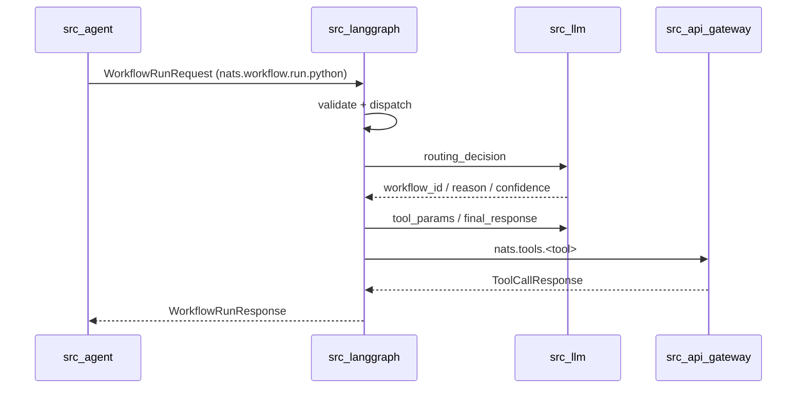
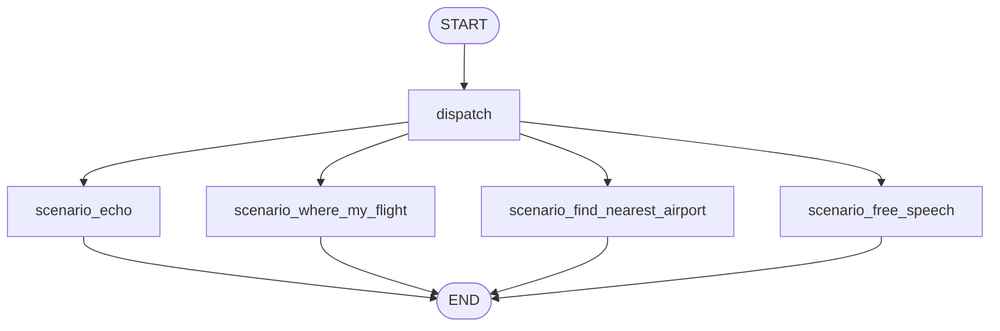

# `src_langgraph`: runtime сценариев на LangGraph

Этот сервис заменяет внешний workflow-движок.
Он принимает запрос по NATS, выбирает сценарий, вызывает LLM/tools и возвращает структурированный ответ в `src_agent`.

Основная идея:
- логика сценариев хранится в коде `scenarios/*.py`
- промпты/названия tools/схемы параметров хранятся отдельно в `config/scenarios/*.json`
- состояние мультишагового диалога хранится в `runtime_state` (через `src_agent`)

---

## 1) Что где лежит (карта кода)

Точка входа:
- `src_langgraph/main.py`

NATS сервис (run + health):
- `src_langgraph/service.py`
- класс: `WorkflowRuntimeService`

Сборка графа и роутинг между узлами:
- `src_langgraph/engine.py`
- класс: `WorkflowEngine`

Роутер сценариев (вызов LLM mode=`routing_decision`):
- `src_langgraph/router.py`

I/O слой для вызовов LLM и tools:
- `src_langgraph/runtime_io.py`
- класс: `RuntimeIO`

Формирование стандартизированных ответов:
- `src_langgraph/responses.py`

Сценарии:
- `src_langgraph/scenarios/echo.py`
- `src_langgraph/scenarios/where_my_flight.py`
- `src_langgraph/scenarios/nearest_airport.py`
- `src_langgraph/scenarios/free_speech.py`

Конфиги сценариев (отдельно от кода):
- `src_langgraph/config/scenarios/router.json`
- `src_langgraph/config/scenarios/where_my_flight.json`
- `src_langgraph/config/scenarios/find_nearest_airport.json`
- `src_langgraph/config/scenarios/free_speech.json`
- загрузка: `src_langgraph/config_loader.py`

Состояние графа:
- `src_langgraph/state.py`

---

## 2) Контракт входа/выхода

Вход:
- `WorkflowRunRequest` (`src_shared/contracts/workflow.py`)

Выход:
- `WorkflowRunResponse` (`src_shared/contracts/workflow.py`)

Обязательные trace-поля в каждом сообщении:
- `trace_id`
- `correlation_id`
- `request_id`
- `session_id`
- `ts_ms`

Зачем это важно:
- сквозная трассировка цепочки
- корректная диагностика ошибок между сервисами
- разделение запросов внутри одной сессии

---

## 3) Полный цикл запроса (по шагам)




Где это в коде:
- подписки на NATS: `service.py` (`run()`)
- обработка run-запроса: `service.py` (`_process_run_message`)
- запуск графа: `engine.py` (`run`)
- dispatch node: `engine.py` (`_node_dispatch`)
- вызов LLM/tools: `runtime_io.py` (`call_llm`, `call_tool`)

---

## 4) Как устроен граф




Сборка графа:
- `engine.py` -> `_build_graph()`

Ключевая логика dispatch:
- если в `runtime` уже есть `active_workflow_id=where_my_flight` и `pending`, то продолжаем этот же сценарий без повторного роутинга
- иначе идем в LLM-роутер (`router.choose_scenario`)

---

## 5) Подробно по сценариям

### 5.1 `where_my_flight@2.0.0`

Файл:
- `scenarios/where_my_flight.py`

Алгоритм:
1. Берет `pending.extracted` из предыдущего шага (если был PARTIAL).
2. Вызывает LLM mode=`tool_params` для извлечения `flight_number/last_name`.
3. Мержит старые и новые параметры.
4. Если параметров недостаточно -> `PARTIAL + ASK_USER_INPUT`.
5. Если параметров достаточно -> вызывает tool `get_flight_status`.
6. Делает финальную формулировку через mode=`final_response`.

Промпты/схемы:
- `config/scenarios/where_my_flight.json`

### 5.2 `find_nearest_airport@2.0.0`

Файл:
- `scenarios/nearest_airport.py`

Алгоритм:
1. Tool `get_current_position`
2. LLM mode=`tool_params` для `search_airports_nearby`
3. Tool `search_airports_nearby`
4. LLM mode=`tool_params` для `build_route`
5. Tool `build_route`
6. LLM mode=`final_response`
7. Возвращает `SHOW_MESSAGE` + client events:
   - `SET_POSITION`
   - `SET_AIRPORTS`
   - `BUILD_ROUTE`

Промпты/схемы:
- `config/scenarios/find_nearest_airport.json`

### 5.3 `free_speech@2.0.0`

Файл:
- `scenarios/free_speech.py`

Алгоритм:
1. Один вызов mode=`final_response`
2. Инструменты не используются
3. Ответ всегда `DONE + SHOW_MESSAGE`

Промпты:
- `config/scenarios/free_speech.json`

### 5.4 `echo@2.0.0`

Файл:
- `scenarios/echo.py`

Алгоритм:
1. Локальный разбор текста (`echo/эхо`)
2. Без LLM и без tools

---

## 6) Как редактировать промпты без правки Python

Менять только JSON:
- `config/scenarios/*.json`

Поддерживаются многострочные блоки:
- строка `"..."` или массив строк `["...", "..."]`
- loader соберет массив в единый текст с переносами (`config_loader.text_block`)

Что можно менять из конфига:
- `prompts.*` (task, scenario_context, default prompts)
- `tools.*` (имена инструментов)
- `schemas.*` (схемы параметров tools)
- `defaults.*` (дефолтные значения сценария)

---

## 7) Как добавить новый сценарий (чеклист)

1. Создай конфиг:
- `config/scenarios/<my_scenario>.json`

2. Создай код сценария:
- `scenarios/<my_scenario>.py`

3. Экспортируй функцию:
- `scenarios/__init__.py`

4. Подключи node в граф:
- `engine.py` -> `_build_graph()`, `_route_after_dispatch()`, node method

5. Добавь сценарий в роутер:
- `config/scenarios/router.json` -> `available_scenarios`

6. Проверь end-to-end:
- локально через UI

---

## 8) Запуск и проверка

Запуск:
```bash
cd docker
COMPOSE_PROFILES=langgraph \
NATS_WORKFLOW_RUN_SUBJECT=nats.workflow.run.python \
NATS_WORKFLOW_HEALTH_SUBJECT=nats.workflow.health.python \
docker compose up -d --build
```

Проверить, что runtime поднялся:
```bash
docker compose logs --tail=100 src_langgraph
```
В логах должно быть:
- `Subscribed to nats.workflow.run.python and nats.workflow.health.python`

Проверочные фразы в UI:
1. `где мой рейс`
2. `SU123`
3. `найди ближайший аэропорт`
4. `как дела`

---

## 9) Частые проблемы

### `no responders available for request`

Причина:
- не поднят `src_langgraph`
- неверный subject в `src_agent`

Проверка:
- в `src_agent` должен быть `NATS_WORKFLOW_RUN_SUBJECT=nats.workflow.run.python`
- `docker compose ps` должен показывать `src_langgraph` в `Up`

### `missing_session_id`

Причина:
- в runtime пришел запрос без `session_id`

Где валидируется:
- `service.py` (`_process_run_message`)

### Ошибка парсинга ответа tool/LLM

Причина:
- сервис вернул не-JSON или несовместимую структуру

Где падает:
- `runtime_io.py` (`_request_json`)
