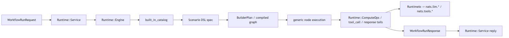
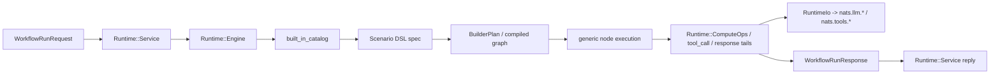

# `src_langgraph_rb`

`src_langgraph_rb` теперь устроен как DSL-driven runtime:

- source of truth для сценария лежит в одном Ruby DSL-файле в [lib/src_langgraph_rb/scenarios](/home/komaroff/dev/monitorsoft/voice-chat/webrtc-komaroff/src_langgraph_rb/lib/src_langgraph_rb/scenarios)
- там же живут graph связи, prompts, tool schemas, defaults, routing hints и policy config
- authoring DSL теперь поддерживает sugar-слой: `tool_profile`, `use_default_tails`, semantic helper methods и auto-generated state keys
- runtime больше не держит отдельные per-scenario Ruby модули и не читает scenario JSON configs
- исполняемая часть интерпретирует DSL через generic node kinds и `Runtime::ComputeOps`

Текущие built-in сценарии:

- `free_speech@2.0.0`
- `where_my_flight@2.0.0`
- `find_nearest_airport@2.0.0`

Cross-project topology и subjects описаны в [`webrtc-komaroff/DOCS/ARCHITECTURE.md`](/home/komaroff/dev/monitorsoft/voice-chat/webrtc-komaroff/DOCS/ARCHITECTURE.md). Этот файл концентрируется только на внутреннем устройстве Ruby runtime.

## Runtime boundary

- inbound subjects:
  - `nats.workflow.run.ruby`
  - `nats.workflow.health.ruby`
- outbound subjects:
  - `nats.llm.<user_id>`
  - `nats.tools.<tool_name>`
- external dependencies:
  - NATS
  - `src_llm`
  - `src_api_gateway`
- wire contracts:
  - [runtime/contracts/workflow.rb](/home/komaroff/dev/monitorsoft/voice-chat/webrtc-komaroff/src_langgraph_rb/lib/src_langgraph_rb/runtime/contracts/workflow.rb)
  - [runtime/contracts/llm.rb](/home/komaroff/dev/monitorsoft/voice-chat/webrtc-komaroff/src_langgraph_rb/lib/src_langgraph_rb/runtime/contracts/llm.rb)
  - [runtime/contracts/tools.rb](/home/komaroff/dev/monitorsoft/voice-chat/webrtc-komaroff/src_langgraph_rb/lib/src_langgraph_rb/runtime/contracts/tools.rb)

Python `src_langgraph` остается отдельным runtime на своих subject-ах. Переключение между Python и Ruby делается только конфигурацией `NATS_WORKFLOW_RUN_SUBJECT` / `NATS_WORKFLOW_HEALTH_SUBJECT` у `src_agent`.

## Как теперь идет запрос





Ключевая идея: graph topology компилируется из DSL, а исполнение узлов делается generic executor-ом. Ruby-код для сценариев не генерируется на диск.

## Слои runtime

| Слой | Файл | Что делает |
| --- | --- | --- |
| entrypoint + settings + transport boundary | [runtime/service.rb](/home/komaroff/dev/monitorsoft/voice-chat/webrtc-komaroff/src_langgraph_rb/lib/src_langgraph_rb/runtime/service.rb) | исполняемый файл, `env -> Settings`, NATS connect, subscribe, run/health reply |
| orchestration | [runtime/engine.rb](/home/komaroff/dev/monitorsoft/voice-chat/webrtc-komaroff/src_langgraph_rb/lib/src_langgraph_rb/runtime/engine.rb) | memory prep, scenario selection, graph invocation, response finalization |
| generic scenario executor | [runtime/compute_ops.rb](/home/komaroff/dev/monitorsoft/voice-chat/webrtc-komaroff/src_langgraph_rb/lib/src_langgraph_rb/runtime/compute_ops.rb) | reusable compute ops вместо per-scenario runtime files |
| downstream IO | [runtime/runtime_io.rb](/home/komaroff/dev/monitorsoft/voice-chat/webrtc-komaroff/src_langgraph_rb/lib/src_langgraph_rb/runtime/runtime_io.rb) | все LLM/tool req-reply boundary |
| scenario router | [runtime/router.rb](/home/komaroff/dev/monitorsoft/voice-chat/webrtc-komaroff/src_langgraph_rb/lib/src_langgraph_rb/runtime/router.rb) | LLM routing по catalog metadata |
| memory | [runtime/memory.rb](/home/komaroff/dev/monitorsoft/voice-chat/webrtc-komaroff/src_langgraph_rb/lib/src_langgraph_rb/runtime/memory.rb) | `summary`, `recent_turns`, `artifact_memory`, compaction |
| authoring DSL | [lib/src_langgraph_rb/scenarios](/home/komaroff/dev/monitorsoft/voice-chat/webrtc-komaroff/src_langgraph_rb/lib/src_langgraph_rb/scenarios) | graph spec + prompts + schemas + defaults + routing descriptions |
| graph adapter | [adapters/lang_graph_rb/builder_plan.rb](/home/komaroff/dev/monitorsoft/voice-chat/webrtc-komaroff/src_langgraph_rb/lib/src_langgraph_rb/adapters/lang_graph_rb/builder_plan.rb) | `Scenario` -> `LangGraphRB::Graph` |

## Source of truth

Для каждого built-in сценария канонический файл теперь один:

- [scenarios/free_speech.rb](/home/komaroff/dev/monitorsoft/voice-chat/webrtc-komaroff/src_langgraph_rb/lib/src_langgraph_rb/scenarios/free_speech.rb)
- [scenarios/where_my_flight.rb](/home/komaroff/dev/monitorsoft/voice-chat/webrtc-komaroff/src_langgraph_rb/lib/src_langgraph_rb/scenarios/where_my_flight.rb)
- [scenarios/find_nearest_airport.rb](/home/komaroff/dev/monitorsoft/voice-chat/webrtc-komaroff/src_langgraph_rb/lib/src_langgraph_rb/scenarios/find_nearest_airport.rb)

Внутри такого файла лежат:

- `title`, `description`, `routing_description`
- `tool_profile` declarations с prompts, schemas и defaults
- `runtime_flags` только там, где они не выводятся автоматически
- prompts и schemas как Ruby constants или profile config
- graph nodes и edges
- authoring helper calls, которые builder понижает в generic runtime nodes

Отдельных scenario runtime-файлов и `config/scenarios/*.json` больше нет.

## Authoring sugar

Автор сценария теперь не обязан явно писать plumbing вида `kind: :compute`, `op: ...`, `status_key`, `merged_key`, `pending_key`, `args_source` для типовых flow.

Поверх базового DSL доступны helper methods:

- `tool_profile`
- `use_default_tails`
- `tool`
- `resolve_context_refs`
- `free_speech_response`
- `pending_tool_params`
- `tool_lookup_response`
- `airport_search_params`
- `airport_route_params`
- `route_response`
- `ask_user_input`
- `done`
- `failed`
- `reroute_scenario`
- `route_status`
- `route_tool_status`
- `finish_with_state`

Также доступны key helpers:

- `status_of(:node)`
- `response_of(:node)`
- `params_of(:node)`
- `prompt_of(:node)`
- `pending_of(:node)`
- `message_of(:node)`

Builder разворачивает эти shorthand forms в тот же `Schema::Graph`, который runtime уже умеет исполнять.

## Ключевые методы и роли

| Файл | Что смотреть |
| --- | --- |
| [runtime/service.rb](/home/komaroff/dev/monitorsoft/voice-chat/webrtc-komaroff/src_langgraph_rb/lib/src_langgraph_rb/runtime/service.rb) | `Settings.from_env`, `Service.run_from_env`, `Service#run`, `handle_run`, `handle_health`, `safe_respond` |
| [runtime/engine.rb](/home/komaroff/dev/monitorsoft/voice-chat/webrtc-komaroff/src_langgraph_rb/lib/src_langgraph_rb/runtime/engine.rb) | `run`, `choose_scenario`, `run_selected_scenario`, `initial_scenario`, `node_callable`, `router_callable`, `finalize_response` |
| [runtime/compute_ops.rb](/home/komaroff/dev/monitorsoft/voice-chat/webrtc-komaroff/src_langgraph_rb/lib/src_langgraph_rb/runtime/compute_ops.rb) | reusable compute ops, retry heuristics, pending/reroute logic, airport route prep |
| [runtime/runtime_io.rb](/home/komaroff/dev/monitorsoft/voice-chat/webrtc-komaroff/src_langgraph_rb/lib/src_langgraph_rb/runtime/runtime_io.rb) | `call_llm`, `call_tool`, `request_json` |
| [runtime/router.rb](/home/komaroff/dev/monitorsoft/voice-chat/webrtc-komaroff/src_langgraph_rb/lib/src_langgraph_rb/runtime/router.rb) | `choose_scenario`, `filtered_scenarios` |

## Node kinds

### Generic node kinds

| DSL `kind` | Что делает |
| --- | --- |
| `compute` | вызывает reusable operation из `Runtime::ComputeOps` |
| `tool_call` | generic tool req-reply |
| `final_response` | `DONE` response из `state[:response_message]` |
| `state_response` | берет уже собранный `state[:response]` |
| `done_response` | terminal success response из указанного state key |
| `failed_response` | terminal failure response из `error_*` keys |
| `partial_response` | `PARTIAL` + `pending` runtime state |

Эти `kind`-ы остаются внутренней compiled form. Автор built-in сценариев теперь чаще работает helper methods из `GraphBuilder`, а не raw `kind` config.

### Compute ops

| `op` | Где используется | Роль |
| --- | --- | --- |
| `resolve_context_references` | `free_speech` | entity extraction из `artifact_memory` и reference resolution |
| `compose_free_speech_response` | `free_speech` | primary/retry LLM answer с quality gate |
| `collect_tool_params_with_pending` | `where_my_flight` | tool params + merge pending + missing/reroute decision |
| `tool_lookup_with_llm_response` | `where_my_flight` | tool call + not_found/error mapping + final LLM text |
| `reroute_selected_scenario` | `where_my_flight` | запуск другого compiled scenario из pending flow |
| `prepare_airport_search` | `find_nearest_airport` | position -> search args |
| `prepare_airport_route` | `find_nearest_airport` | search result -> route args |
| `build_route_with_response` | `find_nearest_airport` | route tool call + final text + client events |

## Router

`Runtime::Router` больше не читает отдельный список сценариев из JSON. Теперь он:

1. берет built-in catalog из `Engine`
2. читает у каждого сценария `metadata.routing_description`
3. фильтрует excluded scenarios
4. вызывает LLM mode `routing_decision`
5. fallback-ит в `free_speech@2.0.0`, если ответ невалиден или вернул неизвестный `workflow_id`

Это означает, что routing hints живут рядом со сценарием, а не в отдельном конфиге.

## Сценарии и их реальное исполнение

| Сценарий | LLM calls | Tool calls | Особое поведение |
| --- | --- | --- | --- |
| `free_speech` | `routing_decision`, `final_response`, `final_response retry` | none | entity resolution из `artifact_memory`, knowledge retry |
| `where_my_flight` | `tool_params`, `final_response` | `get_flight_status` | pending params, follow-up match, reroute |
| `find_nearest_airport` | `tool_params search`, `tool_params route`, `final_response` | `get_current_position`, `search_airports_nearby`, `build_route` | client events `SET_POSITION`, `SET_AIRPORTS`, `BUILD_ROUTE` |

## Где runtime обращается к LLM и tools

Все LLM/tool вызовы идут только через [runtime/runtime_io.rb](/home/komaroff/dev/monitorsoft/voice-chat/webrtc-komaroff/src_langgraph_rb/lib/src_langgraph_rb/runtime/runtime_io.rb):

- `RuntimeIo#call_llm`
- `RuntimeIo#call_tool`

Сценарии больше не делают это через отдельные runtime файлы. Они только описывают config для `compute` nodes.

## Ошибки и границы

| Граница | Что нормализуется |
| --- | --- |
| [runtime/service.rb](/home/komaroff/dev/monitorsoft/voice-chat/webrtc-komaroff/src_langgraph_rb/lib/src_langgraph_rb/runtime/service.rb) | invalid request, missing `session_id`, generic workflow failure, health failure |
| [runtime/runtime_io.rb](/home/komaroff/dev/monitorsoft/voice-chat/webrtc-komaroff/src_langgraph_rb/lib/src_langgraph_rb/runtime/runtime_io.rb) | downstream timeout, no responders, invalid JSON, `llm_transport_error`, `tool_transport_error` |
| [runtime/engine.rb](/home/komaroff/dev/monitorsoft/voice-chat/webrtc-komaroff/src_langgraph_rb/lib/src_langgraph_rb/runtime/engine.rb) | missing scenario in registry, missing final `state[:response]` |
| [runtime/compute_ops.rb](/home/komaroff/dev/monitorsoft/voice-chat/webrtc-komaroff/src_langgraph_rb/lib/src_langgraph_rb/runtime/compute_ops.rb) | scenario-level compute logic, pending/reroute, route arg assembly, retry heuristics |

## Локальный запуск

Первичная настройка:

```bash
cd src_langgraph_rb
bin/setup
```

Локальный запуск runtime:

```bash
cd src_langgraph_rb
NATS_URL=nats://localhost:4222 \
NATS_WORKFLOW_RUN_SUBJECT=nats.workflow.run.ruby \
NATS_WORKFLOW_HEALTH_SUBJECT=nats.workflow.health.ruby \
bundle exec ruby ./lib/src_langgraph_rb/runtime/service.rb
```

## Где менять код

| Нужно изменить | Где править |
| --- | --- |
| graph structure, prompts, schemas, defaults, routing hints | [lib/src_langgraph_rb/scenarios](/home/komaroff/dev/monitorsoft/voice-chat/webrtc-komaroff/src_langgraph_rb/lib/src_langgraph_rb/scenarios) |
| generic compute behavior | [runtime/compute_ops.rb](/home/komaroff/dev/monitorsoft/voice-chat/webrtc-komaroff/src_langgraph_rb/lib/src_langgraph_rb/runtime/compute_ops.rb) |
| orchestration / graph invocation / finalization | [runtime/engine.rb](/home/komaroff/dev/monitorsoft/voice-chat/webrtc-komaroff/src_langgraph_rb/lib/src_langgraph_rb/runtime/engine.rb) |
| router policy | [runtime/router.rb](/home/komaroff/dev/monitorsoft/voice-chat/webrtc-komaroff/src_langgraph_rb/lib/src_langgraph_rb/runtime/router.rb) |
| transport boundary | [runtime/service.rb](/home/komaroff/dev/monitorsoft/voice-chat/webrtc-komaroff/src_langgraph_rb/lib/src_langgraph_rb/runtime/service.rb), [runtime/runtime_io.rb](/home/komaroff/dev/monitorsoft/voice-chat/webrtc-komaroff/src_langgraph_rb/lib/src_langgraph_rb/runtime/runtime_io.rb) |

## Ограничения

- runtime не генерирует Ruby-код сценариев на диск; он интерпретирует DSL spec
- generic executor уже один, но некоторые compute ops все еще domain-shaped и требуют дальнейшей унификации при появлении новых сценариев
- `artifact_memory` по-прежнему обновляется через `client_events`, а не отдельным hidden side-channel
- `free_speech` retry heuristics и flight/airport deterministic transforms сейчас живут в `Runtime::ComputeOps`
