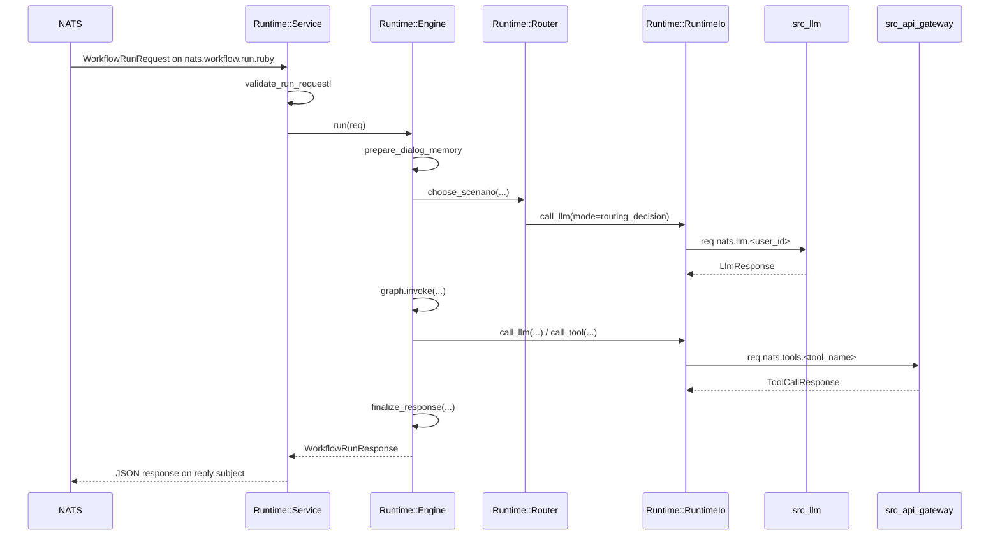
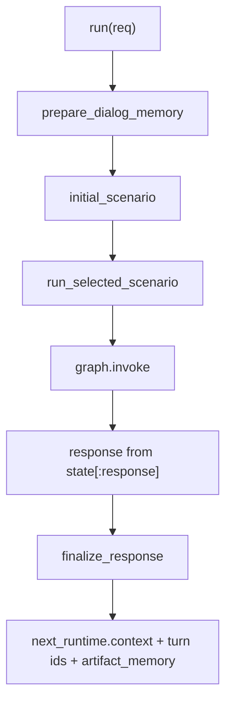
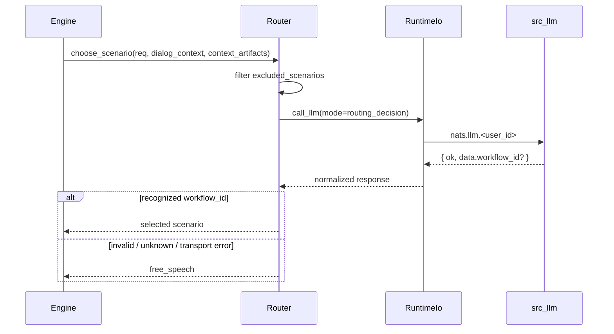
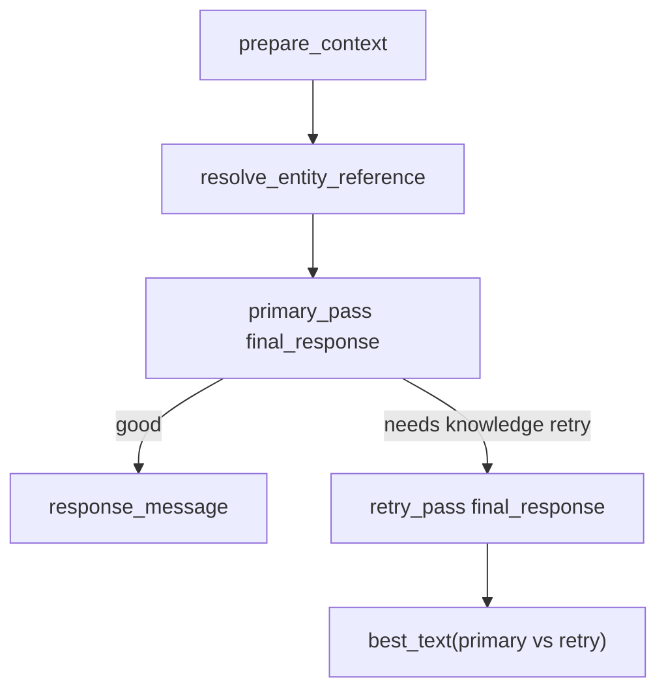
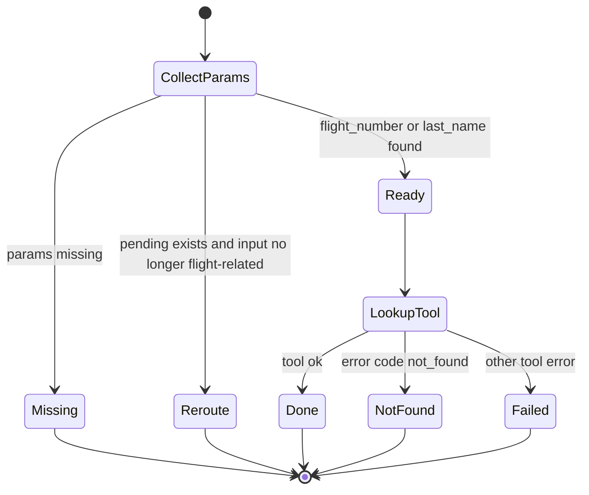
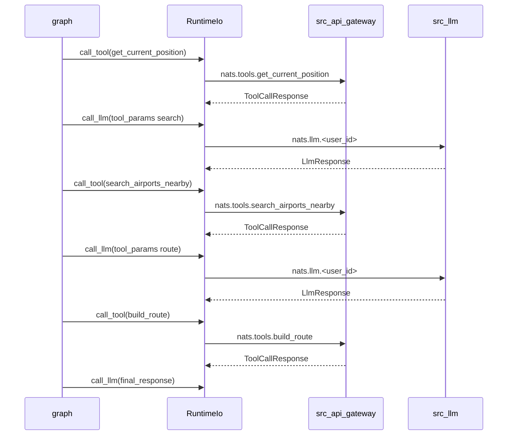
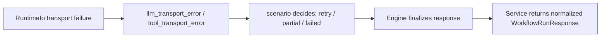

# `src_langgraph_rb`

`src_langgraph_rb` совмещает Ruby runtime и декларативный DSL/catalog для мигрированных сценариев:

- `free_speech@2.0.0`
- `where_my_flight@2.0.0`
- `find_nearest_airport@2.0.0`

Cross-project topology, transport layers и внешние subjects описаны в [`webrtc-komaroff/DOCS/ARCHITECTURE.md`](/home/komaroff/dev/monitorsoft/voice-chat/webrtc-komaroff/DOCS/ARCHITECTURE.md). Этот файл ниже концентрируется только на внутреннем устройстве Ruby runtime.

## Runtime boundary

- inbound subjects:
  - `nats.workflow.run.ruby`
  - `nats.workflow.health.ruby`
- outbound subjects:
  - `nats.llm.<user_id>`
  - `nats.tools.<tool_name>`
- external dependencies:
  - NATS
  - `src_llm`
  - `src_api_gateway`
- wire contracts:
  - [`runtime/contracts/workflow.rb`](/home/komaroff/dev/monitorsoft/voice-chat/webrtc-komaroff/src_langgraph_rb/lib/src_langgraph_rb/runtime/contracts/workflow.rb)
  - [`runtime/contracts/llm.rb`](/home/komaroff/dev/monitorsoft/voice-chat/webrtc-komaroff/src_langgraph_rb/lib/src_langgraph_rb/runtime/contracts/llm.rb)
  - [`runtime/contracts/tools.rb`](/home/komaroff/dev/monitorsoft/voice-chat/webrtc-komaroff/src_langgraph_rb/lib/src_langgraph_rb/runtime/contracts/tools.rb)

Python `src_langgraph` остается отдельным runtime на своих subject-ах. Переключение между Python и Ruby делается только конфигурацией `NATS_WORKFLOW_RUN_SUBJECT` / `NATS_WORKFLOW_HEALTH_SUBJECT` у `src_agent`. Скрытого fallback между runtime нет.

## Запрос целиком



## Слои runtime

| Слой | Файл | Что делает |
| --- | --- | --- |
| entrypoint + settings + transport boundary | [runtime/service.rb](/home/komaroff/dev/monitorsoft/voice-chat/webrtc-komaroff/src_langgraph_rb/lib/src_langgraph_rb/runtime/service.rb) | исполняемый файл, `env -> Settings`, `run_from_env`, NATS connect, subscribe, req validation, health, reply safety |
| orchestration | [runtime/engine.rb](/home/komaroff/dev/monitorsoft/voice-chat/webrtc-komaroff/src_langgraph_rb/lib/src_langgraph_rb/runtime/engine.rb) | memory prep, scenario selection, graph invocation, final response |
| downstream IO | [runtime/runtime_io.rb](/home/komaroff/dev/monitorsoft/voice-chat/webrtc-komaroff/src_langgraph_rb/lib/src_langgraph_rb/runtime/runtime_io.rb) | все LLM/tool вызовы |
| scenario router | [runtime/router.rb](/home/komaroff/dev/monitorsoft/voice-chat/webrtc-komaroff/src_langgraph_rb/lib/src_langgraph_rb/runtime/router.rb) | LLM-based выбор сценария |
| memory | [runtime/memory.rb](/home/komaroff/dev/monitorsoft/voice-chat/webrtc-komaroff/src_langgraph_rb/lib/src_langgraph_rb/runtime/memory.rb) | `summary`, `recent_turns`, `artifact_memory`, compaction |
| scenario logic | [runtime/scenarios](/home/komaroff/dev/monitorsoft/voice-chat/webrtc-komaroff/src_langgraph_rb/lib/src_langgraph_rb/runtime/scenarios) | executable behavior для каждого сценария |
| authoring DSL | [lib/src_langgraph_rb/scenarios](/home/komaroff/dev/monitorsoft/voice-chat/webrtc-komaroff/src_langgraph_rb/lib/src_langgraph_rb/scenarios) | декларативные graph specs |
| graph adapter | [adapters/lang_graph_rb/builder_plan.rb](/home/komaroff/dev/monitorsoft/voice-chat/webrtc-komaroff/src_langgraph_rb/lib/src_langgraph_rb/adapters/lang_graph_rb/builder_plan.rb) | DSL -> `LangGraphRB::Graph` |

## Ключевые методы

| Метод | Роль |
| --- | --- |
| [`Runtime::Settings.from_env`](/home/komaroff/dev/monitorsoft/voice-chat/webrtc-komaroff/src_langgraph_rb/lib/src_langgraph_rb/runtime/service.rb#L26) | читает env и собирает typed runtime settings |
| [`Runtime::Service.run_from_env`](/home/komaroff/dev/monitorsoft/voice-chat/webrtc-komaroff/src_langgraph_rb/lib/src_langgraph_rb/runtime/service.rb#L46) | единая CLI/library точка входа для запуска runtime |
| [`Runtime::Service#run`](/home/komaroff/dev/monitorsoft/voice-chat/webrtc-komaroff/src_langgraph_rb/lib/src_langgraph_rb/runtime/service.rb#L58) | соединяется с NATS, создает `RuntimeIo` и `Engine`, подписывается на run/health subjects |
| [`Runtime::Service#handle_run`](/home/komaroff/dev/monitorsoft/voice-chat/webrtc-komaroff/src_langgraph_rb/lib/src_langgraph_rb/runtime/service.rb#L107) | `JSON.parse`, `validate_run_request!`, проверка `session_id`, вызов `@engine.run`, fallback на `invalid_run_response` |
| [`Runtime::Service#handle_health`](/home/komaroff/dev/monitorsoft/voice-chat/webrtc-komaroff/src_langgraph_rb/lib/src_langgraph_rb/runtime/service.rb#L135) | health req-reply с `service: "src_langgraph_rb"` и `run_subject` |
| [`Runtime::Service#safe_respond`](/home/komaroff/dev/monitorsoft/voice-chat/webrtc-komaroff/src_langgraph_rb/lib/src_langgraph_rb/runtime/service.rb#L156) | отвечает только если у сообщения есть `reply`, логирует ошибку ответа |
| [`Runtime::Engine#run`](/home/komaroff/dev/monitorsoft/voice-chat/webrtc-komaroff/src_langgraph_rb/lib/src_langgraph_rb/runtime/engine.rb#L17) | назначает turn ids, готовит memory, выбирает сценарий, вызывает graph, финализирует runtime context |
| [`Runtime::Engine#initial_scenario`](/home/komaroff/dev/monitorsoft/voice-chat/webrtc-komaroff/src_langgraph_rb/lib/src_langgraph_rb/runtime/engine.rb#L69) | уважает pending `where_my_flight`, иначе идет в router |
| [`Runtime::Engine#run_selected_scenario`](/home/komaroff/dev/monitorsoft/voice-chat/webrtc-komaroff/src_langgraph_rb/lib/src_langgraph_rb/runtime/engine.rb#L55) | берет compiled graph, вызывает `graph.invoke`, требует финальный `WorkflowRunResponse` |
| [`Runtime::Engine#node_callable`](/home/komaroff/dev/monitorsoft/voice-chat/webrtc-komaroff/src_langgraph_rb/lib/src_langgraph_rb/runtime/engine.rb#L90) | центральный dispatch от DSL node kind к runtime method |
| [`Runtime::Engine#router_callable`](/home/komaroff/dev/monitorsoft/voice-chat/webrtc-komaroff/src_langgraph_rb/lib/src_langgraph_rb/runtime/engine.rb#L177) | dispatch от DSL router id к state key |
| [`Runtime::Engine#finalize_response`](/home/komaroff/dev/monitorsoft/voice-chat/webrtc-komaroff/src_langgraph_rb/lib/src_langgraph_rb/runtime/engine.rb#L201) | записывает `next_runtime.context`, обновляет `artifact_memory`, inject turn ids |
| [`Runtime::RuntimeIo#call_llm`](/home/komaroff/dev/monitorsoft/voice-chat/webrtc-komaroff/src_langgraph_rb/lib/src_langgraph_rb/runtime/runtime_io.rb#L19) | строит `LlmRequest`, делает req-reply в `nats.llm.<user_id>`, нормализует `LlmResponse` |
| [`Runtime::RuntimeIo#call_tool`](/home/komaroff/dev/monitorsoft/voice-chat/webrtc-komaroff/src_langgraph_rb/lib/src_langgraph_rb/runtime/runtime_io.rb#L33) | строит `ToolCallRequest`, делает req-reply в `nats.tools.<tool_name>`, нормализует ответ |
| [`Runtime::RuntimeIo#request_json`](/home/komaroff/dev/monitorsoft/voice-chat/webrtc-komaroff/src_langgraph_rb/lib/src_langgraph_rb/runtime/runtime_io.rb#L60) | низкоуровневый `nc.request`, `JSON.parse`, проверка `Hash` |
| [`Runtime::Router.choose_scenario`](/home/komaroff/dev/monitorsoft/voice-chat/webrtc-komaroff/src_langgraph_rb/lib/src_langgraph_rb/runtime/router.rb#L31) | формирует router prompt и вызывает LLM mode `routing_decision` |

## Что происходит внутри `Engine`

1. `run(req)` назначает `user_turn_id` и `assistant_turn_id`.
2. `Runtime::Memory.prepare_dialog_memory` достает `summary`, `recent_turns`, `dialog_context`, `context_extra`.
3. `initial_scenario` решает:
   - если висит pending по `where_my_flight`, продолжать его;
   - иначе вызвать `Router.choose_scenario`.
4. `run_selected_scenario` берет compiled graph из built-in catalog и запускает `graph.invoke`.
5. `finalize_response`:
   - дополняет `next_runtime.context`;
   - добавляет `artifact_memory` по `SET_AIRPORTS`, `SET_POSITION`, `BUILD_ROUTE`;
   - вставляет `user_turn_id` и `assistant_turn_id` в `client_handler`.



## Router и выбор сценария

`Runtime::Router` использует config из [`config/scenarios/router.json`](/home/komaroff/dev/monitorsoft/voice-chat/webrtc-komaroff/src_langgraph_rb/config/scenarios/router.json), берет `task`, список доступных сценариев и вызывает LLM mode `routing_decision`.

Если ответ невалидный или вернул неизвестный `workflow_id`, fallback всегда один: `free_speech`.



## Карта node kinds и router ids

### Node kinds

| DSL `kind` | Runtime method |
| --- | --- |
| `context_enrichment` | `Runtime::Scenarios::FreeSpeech.prepare_context` |
| `free_speech_primary` | `Runtime::Scenarios::FreeSpeech.primary_pass` |
| `free_speech_retry` | `Runtime::Scenarios::FreeSpeech.retry_pass` |
| `flight_collect_params` | `Runtime::Scenarios::WhereMyFlight.collect_params` |
| `flight_lookup_tool` | `Runtime::Scenarios::WhereMyFlight.lookup_tool` |
| `flight_reroute` | `Runtime::Scenarios::WhereMyFlight.reroute` |
| `airport_prepare_search` | `Runtime::Scenarios::FindNearestAirport.prepare_search` |
| `airport_prepare_route` | `Runtime::Scenarios::FindNearestAirport.prepare_route` |
| `airport_build_route` | `Runtime::Scenarios::FindNearestAirport.build_route` |
| `tool_call` | `Engine#generic_tool_call` |
| `final_response` | `Runtime::Responses.done_response(...)` |
| `state_response` | `Engine#ensure_response!` |
| `done_response` | `Runtime::Responses.done_response(...)` |
| `failed_response` | `Runtime::Responses.failed_response(...)` |
| `partial_response` | `Runtime::Responses.partial_response(...)` |

### Router ids

| Router id | State key |
| --- | --- |
| `free_speech_entry` | `state[:free_speech_entry]` |
| `free_speech_primary_result` | `state[:free_speech_primary_result]` |
| `flight_param_status` | `state[:flight_param_status]` |
| `flight_tool_result_status` | `state[:flight_tool_result_status]` |
| `tool_status` | `state[:last_tool_ok] ? "ok" : "failed"` |
| `route_args_status` | `state[:route_args_status]` |
| `airport_route_result_status` | `state[:airport_route_result_status]` |

Неизвестный `kind` или `router` приводит к `SrcLanggraphRb::ValidationError`.

## Где runtime обращается к LLM

| Сценарий / слой | Метод | LLM mode | Зачем |
| --- | --- | --- | --- |
| Router | [`Runtime::Router.choose_scenario`](/home/komaroff/dev/monitorsoft/voice-chat/webrtc-komaroff/src_langgraph_rb/lib/src_langgraph_rb/runtime/router.rb#L31) | `routing_decision` | выбрать сценарий |
| `free_speech` | [`FreeSpeech.primary_pass`](/home/komaroff/dev/monitorsoft/voice-chat/webrtc-komaroff/src_langgraph_rb/lib/src_langgraph_rb/runtime/scenarios/free_speech.rb#L73) | `final_response` | основной ответ |
| `free_speech` | [`FreeSpeech.retry_pass`](/home/komaroff/dev/monitorsoft/voice-chat/webrtc-komaroff/src_langgraph_rb/lib/src_langgraph_rb/runtime/scenarios/free_speech.rb#L112) | `final_response` | retry с knowledge hint |
| `where_my_flight` | [`WhereMyFlight.collect_params`](/home/komaroff/dev/monitorsoft/voice-chat/webrtc-komaroff/src_langgraph_rb/lib/src_langgraph_rb/runtime/scenarios/where_my_flight.rb#L44) | `tool_params` | вытащить `flight_number` / `last_name` |
| `where_my_flight` | [`WhereMyFlight.lookup_tool`](/home/komaroff/dev/monitorsoft/voice-chat/webrtc-komaroff/src_langgraph_rb/lib/src_langgraph_rb/runtime/scenarios/where_my_flight.rb#L114) | `final_response` | финальный текст по tool result |
| `find_nearest_airport` | [`FindNearestAirport.prepare_search`](/home/komaroff/dev/monitorsoft/voice-chat/webrtc-komaroff/src_langgraph_rb/lib/src_langgraph_rb/runtime/scenarios/find_nearest_airport.rb#L57) | `tool_params` | search args для airport search |
| `find_nearest_airport` | [`FindNearestAirport.prepare_route`](/home/komaroff/dev/monitorsoft/voice-chat/webrtc-komaroff/src_langgraph_rb/lib/src_langgraph_rb/runtime/scenarios/find_nearest_airport.rb#L88) | `tool_params` | route args |
| `find_nearest_airport` | [`FindNearestAirport.build_route`](/home/komaroff/dev/monitorsoft/voice-chat/webrtc-komaroff/src_langgraph_rb/lib/src_langgraph_rb/runtime/scenarios/find_nearest_airport.rb#L117) | `final_response` | финальный текст по route result |

Все эти вызовы идут только через [`Runtime::RuntimeIo#call_llm`](/home/komaroff/dev/monitorsoft/voice-chat/webrtc-komaroff/src_langgraph_rb/lib/src_langgraph_rb/runtime/runtime_io.rb#L19).

## Где runtime обращается к tools

| Сценарий | Метод | Tool name |
| --- | --- | --- |
| `where_my_flight` | [`WhereMyFlight.lookup_tool`](/home/komaroff/dev/monitorsoft/voice-chat/webrtc-komaroff/src_langgraph_rb/lib/src_langgraph_rb/runtime/scenarios/where_my_flight.rb#L114) | `get_flight_status` |
| `find_nearest_airport` | generic `tool_call` node | `get_current_position` |
| `find_nearest_airport` | generic `tool_call` node | `search_airports_nearby` |
| `find_nearest_airport` | [`FindNearestAirport.build_route`](/home/komaroff/dev/monitorsoft/voice-chat/webrtc-komaroff/src_langgraph_rb/lib/src_langgraph_rb/runtime/scenarios/find_nearest_airport.rb#L117) | `build_route` |

Все tool вызовы идут только через [`Runtime::RuntimeIo#call_tool`](/home/komaroff/dev/monitorsoft/voice-chat/webrtc-komaroff/src_langgraph_rb/lib/src_langgraph_rb/runtime/runtime_io.rb#L33).

## Сценарии

### `free_speech`

Ключевые методы:

- [`prepare_context`](/home/komaroff/dev/monitorsoft/voice-chat/webrtc-komaroff/src_langgraph_rb/lib/src_langgraph_rb/runtime/scenarios/free_speech.rb#L53)
- [`primary_pass`](/home/komaroff/dev/monitorsoft/voice-chat/webrtc-komaroff/src_langgraph_rb/lib/src_langgraph_rb/runtime/scenarios/free_speech.rb#L73)
- [`retry_pass`](/home/komaroff/dev/monitorsoft/voice-chat/webrtc-komaroff/src_langgraph_rb/lib/src_langgraph_rb/runtime/scenarios/free_speech.rb#L112)

Что делает:

- извлекает entities из `artifact_memory`;
- пытается разрешить ссылки типа `он/они/этот/эти`;
- делает primary LLM pass;
- если ответ выглядит как context-only refusal на фактический вопрос, делает retry с knowledge hint;
- выбирает лучший текст из primary/retry.



### `where_my_flight`

Ключевые методы:

- [`collect_params`](/home/komaroff/dev/monitorsoft/voice-chat/webrtc-komaroff/src_langgraph_rb/lib/src_langgraph_rb/runtime/scenarios/where_my_flight.rb#L44)
- [`lookup_tool`](/home/komaroff/dev/monitorsoft/voice-chat/webrtc-komaroff/src_langgraph_rb/lib/src_langgraph_rb/runtime/scenarios/where_my_flight.rb#L114)
- [`reroute`](/home/komaroff/dev/monitorsoft/voice-chat/webrtc-komaroff/src_langgraph_rb/lib/src_langgraph_rb/runtime/scenarios/where_my_flight.rb#L156)

Что делает:

- через LLM `tool_params` пытается собрать `flight_number` или `last_name`;
- если параметров не хватает, возвращает `PARTIAL` c `pending_state`;
- если был pending и новый input уже не flight-related, уходит в `engine.choose_scenario(...)` и reroute;
- если параметры готовы, вызывает `get_flight_status`;
- по tool result вызывает `final_response`.



### `find_nearest_airport`

Ключевые методы:

- [`prepare_search`](/home/komaroff/dev/monitorsoft/voice-chat/webrtc-komaroff/src_langgraph_rb/lib/src_langgraph_rb/runtime/scenarios/find_nearest_airport.rb#L57)
- [`prepare_route`](/home/komaroff/dev/monitorsoft/voice-chat/webrtc-komaroff/src_langgraph_rb/lib/src_langgraph_rb/runtime/scenarios/find_nearest_airport.rb#L88)
- [`build_route`](/home/komaroff/dev/monitorsoft/voice-chat/webrtc-komaroff/src_langgraph_rb/lib/src_langgraph_rb/runtime/scenarios/find_nearest_airport.rb#L117)

Что делает:

- берет текущую позицию через tool;
- просит LLM собрать search args;
- вызывает `search_airports_nearby`;
- просит LLM собрать route args;
- вызывает `build_route`;
- делает `final_response`;
- пишет client events `SET_POSITION`, `SET_AIRPORTS`, `BUILD_ROUTE`, которые потом сохраняются в `artifact_memory`.



## Как `artifact_memory` наполняется

`Runtime::Engine#finalize_response` берет `client_events` и сохраняет в `next_runtime.context.extra.artifact_memory` только три вида данных:

- `SET_AIRPORTS` -> `last_airports`
- `SET_POSITION` -> `last_position`
- `BUILD_ROUTE` -> `last_route`

Это важно для `free_speech`, потому что `prepare_context` читает именно `artifact_memory` для referential context.

## Исключения и границы ошибок

### Локальные типы исключений

- [`SrcLanggraphRb::Error`](/home/komaroff/dev/monitorsoft/voice-chat/webrtc-komaroff/src_langgraph_rb/lib/src_langgraph_rb/errors.rb#L4)
- [`SrcLanggraphRb::ValidationError`](/home/komaroff/dev/monitorsoft/voice-chat/webrtc-komaroff/src_langgraph_rb/lib/src_langgraph_rb/errors.rb#L5)
- [`SrcLanggraphRb::RegistryError`](/home/komaroff/dev/monitorsoft/voice-chat/webrtc-komaroff/src_langgraph_rb/lib/src_langgraph_rb/errors.rb#L6)
- [`SrcLanggraphRb::FragmentError`](/home/komaroff/dev/monitorsoft/voice-chat/webrtc-komaroff/src_langgraph_rb/lib/src_langgraph_rb/errors.rb#L7)

### Где они возникают

| Граница | Возможная ошибка | Что вернется наружу |
| --- | --- | --- |
| `Service#handle_run` | invalid JSON, invalid workflow request, missing `session_id`, любое `StandardError` из engine | normalized `WorkflowRunResponse` со `status: FAILED` и `errors[code=workflow_failed]` |
| `Service#handle_health` | invalid JSON, contract error, internal exception | unhealthy payload с `error.code=health_failed` |
| `Engine#run_selected_scenario` | отсутствует graph в registry | `RegistryError` |
| `Engine#node_callable` / `router_callable` | unsupported `kind` / `router` | `ValidationError` |
| `RuntimeIo#request_json` | таймаут, no responders, invalid JSON, response is not `Hash` | upstream exception |
| `RuntimeIo#call_llm` | любой transport exception | synthetic `LlmResponse(ok: false, error.code=llm_transport_error)` |
| `RuntimeIo#call_tool` | любой transport exception | synthetic `ToolCallResponse(ok: false, error.code=tool_transport_error)` |
| scenario methods | tool errors, route args missing, not found | state-driven `FAILED`, `PARTIAL` или scenario-specific fallback |

### Какой error flow считается boundary-safe



## Где менять код

| Изменение | Где править |
| --- | --- |
| prompts / schema / tool names | [config/scenarios](/home/komaroff/dev/monitorsoft/voice-chat/webrtc-komaroff/src_langgraph_rb/config/scenarios) |
| graph structure | [lib/src_langgraph_rb/scenarios](/home/komaroff/dev/monitorsoft/voice-chat/webrtc-komaroff/src_langgraph_rb/lib/src_langgraph_rb/scenarios) |
| runtime behavior | [lib/src_langgraph_rb/runtime/scenarios](/home/komaroff/dev/monitorsoft/voice-chat/webrtc-komaroff/src_langgraph_rb/lib/src_langgraph_rb/runtime/scenarios) |
| orchestration rules | [runtime/engine.rb](/home/komaroff/dev/monitorsoft/voice-chat/webrtc-komaroff/src_langgraph_rb/lib/src_langgraph_rb/runtime/engine.rb) |
| transport contract / NATS boundary | [runtime/service.rb](/home/komaroff/dev/monitorsoft/voice-chat/webrtc-komaroff/src_langgraph_rb/lib/src_langgraph_rb/runtime/service.rb), [runtime/runtime_io.rb](/home/komaroff/dev/monitorsoft/voice-chat/webrtc-komaroff/src_langgraph_rb/lib/src_langgraph_rb/runtime/runtime_io.rb) |

## Локальный запуск

Первичная настройка:

```bash
cd src_langgraph_rb
bin/setup
```

Локальный запуск runtime:

```bash
cd src_langgraph_rb
NATS_URL=nats://localhost:4222 \
NATS_WORKFLOW_RUN_SUBJECT=nats.workflow.run.ruby \
NATS_WORKFLOW_HEALTH_SUBJECT=nats.workflow.health.ruby \
bundle exec ruby ./lib/src_langgraph_rb/runtime/service.rb
```

## Ограничения

- Ruby runtime не реализует `echo@2.0.0`.
- runtime не лечит внешний LLM/tool сервис, он только нормализует transport failures.
- все исполняемые переходы должны пройти через DSL `kind/router` mapping; inline execution blocks по-прежнему не являются основной моделью.
- browser/map side effects сохраняются только через `client_events` -> `artifact_memory`; отдельного hidden side-channel нет.
